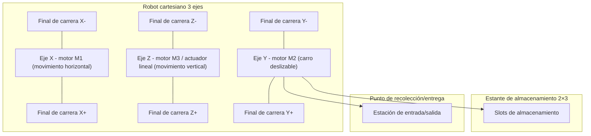
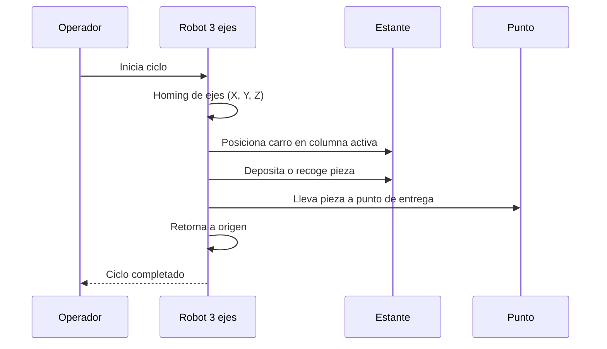
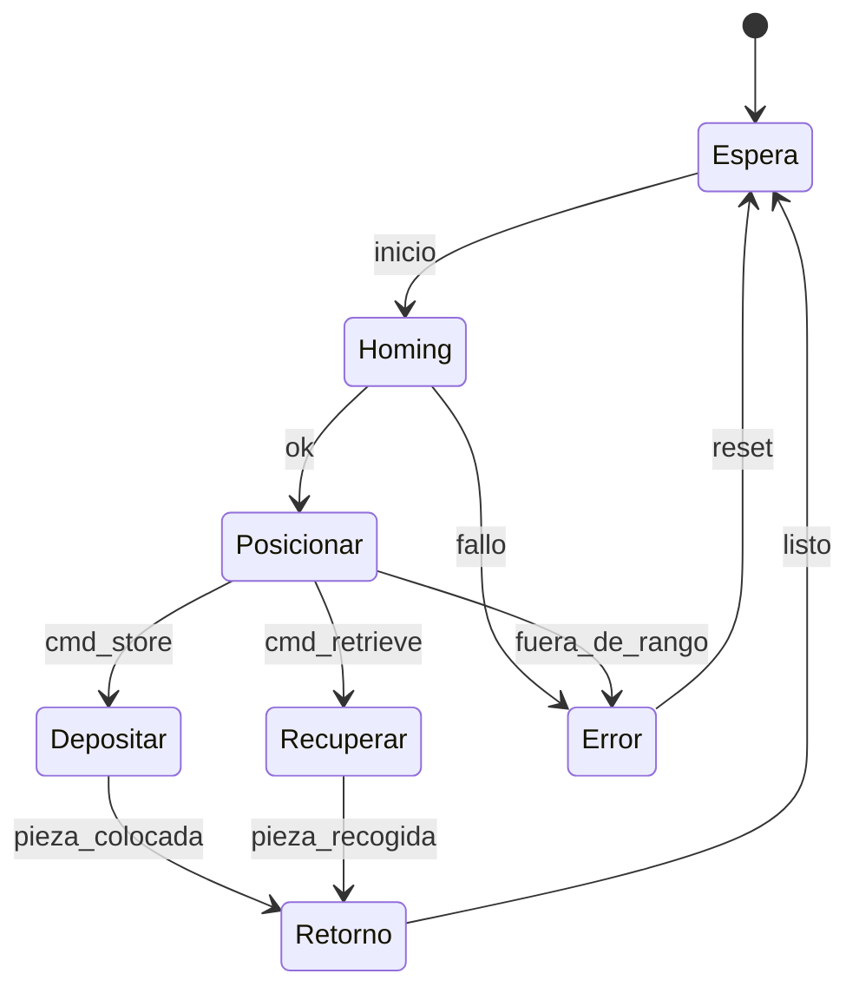
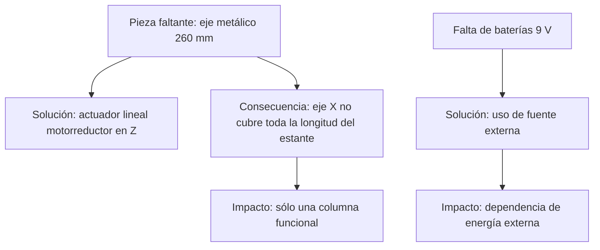

Excelente. Lo que tienes ahora es una **versión centrada en la construcción y resolución de problemas**, mientras tu grupo ya redactó bastante de la **programación en ROBO Pro Coding y uso del controlador ROBO TX**.
La mejor forma es **integrar ambos enfoques** en el README final: el tuyo aporta el ensamble físico y los problemas de hardware, y el de ellos aporta la lógica de control y la programación.

Aquí te dejo el README unificado (ya con todo lo que enviaste, las secciones de tu grupo integradas, los diagramas Mermaid corregidos y un apartado para fragmentos de código):

---

# Proyecto Intermedio #1 – IIoT

## Máquina de Almacenamiento con Robot 3D Fischertechnik

---

## 1. Introducción

### 1.1 Resumen General

Este proyecto corresponde a la **construcción, programación y validación** de un prototipo de máquina de almacenamiento automatizada basado en el modelo **High Bay Storage Rack** de Fischertechnik.
El sistema es un **robot cartesiano de tres ejes (X, Y, Z)** que utiliza un carro deslizable para depositar y recoger piezas en un **estante de 2×3 posiciones**.

Actualmente, por limitaciones de repuestos, se validó solo la **primera columna del estante**, pero el diseño es **escalable** al resto de las posiciones. El control se desarrolló con el **ROBO TX Automation Robots** programado en **ROBO Pro Coding**, gestionando motores y sensores de final de carrera.

### 1.2 Motivación y Justificación

Los sistemas AS/RS son esenciales en la logística moderna e Industria 4.0. El presente prototipo permite:

* Comprender la **mecánica de robots cartesianos**.
* Desarrollar **habilidades en control de motores, sensores y rutinas de referencia**.
* Practicar la **resolución de problemas reales de ensamble**.
* Integrar hardware y software en un entorno educativo.

### 1.3 Estructura del Documento

1. Introducción
2. Solución propuesta
3. Configuración experimental, resultados y análisis
4. Avances constructivos documentados
5. Autoevaluación
6. Conclusiones y trabajo futuro
7. Referencias
8. Anexos

---

## 2. Solución Propuesta

### 2.1 Restricciones de Diseño

| Código | Restricción / Requerimiento                        | Tipo          | Impacto |
| -----: | -------------------------------------------------- | ------------- | ------- |
|     R1 | Movimiento cartesiano en 3 ejes (X, Y, Z)          | Funcional     | Alta    |
|     R2 | Operación en **9 V** (no 24 V estándar industrial) | Técnica       | Alta    |
|     R3 | Faltan ejes de **260 mm (Art.-No. 107436)**        | Mecánica      | Alta    |
|     R4 | Sustitución de un eje por **actuador lineal**      | Restricción   | Media   |
|     R5 | Adaptación con motorreductores alternativos        | Técnica       | Media   |
|     R6 | Limitación de baterías 9 V para pruebas            | Operativa     | Media   |
|     R7 | Operación solo en la primera columna del estante   | Escalabilidad | Media   |
|     R8 | Tiempo de entrega corto                            | Temporal      | Alta    |

---

### 2.2 Arquitectura Física



---

### 2.3 Criterios de Diseño

* **Modularidad:** cada eje es independiente y ensamblado por etapas.
* **Adaptación:** reemplazo de piezas ausentes por soluciones mecánicas funcionales.
* **Seguridad:** finales de carrera en cada eje para homing.
* **Energía:** compatibilidad con 9 V por limitaciones de fuente.
* **Escalabilidad:** estante parcial → estante completo al reponer piezas.

---

### 2.4 Diagramas de Operación

#### Flujo de operación



#### Estados del sistema



---

### 2.5 Retos de Construcción



---

## 3. Configuración Experimental, Resultados y Análisis

### 3.1 Montaje físico

* Ensamble estructural del sistema cartesiano.
* Verificación de homing con finales de carrera.
* Sustitución del tornillo vertical por carril + actuador lineal.
* Validación de movimientos básicos en X, Y y Z.

### 3.2 Programación y pruebas de referencia

El sistema fue programado en **ROBO Pro Coding** para realizar rutinas de homing y movimiento.
Ejemplo de funciones implementadas:

```python
def reference_m1():
    TXT_M_M1_encodermotor.move_to(0, 200)
    TXT_M_M1_encodermotor.start_sync()
    TXT_M_M1_encodermotor.wait_for()
    print("Referencia M1 lista")

def reference_m2():
    TXT_M_M2_motor.set_speed(150, Motor.CCW)
    TXT_M_M2_motor.start_sync()
    while not TXT_I2_switch.state():
        sleep(0.01)
    TXT_M_M2_motor.stop()
    print("Referencia M2 lista")
```

(Se programaron funciones equivalentes para M3 y rutinas de movimiento en cada eje.)

### 3.3 Resultados

* Movimientos X, Y, Z estables con alimentación a 9 V.
* Carro deslizable funcional en operaciones de carga y descarga.
* Se comprobó la capacidad mecánica de ejecutar los movimientos necesarios.
* Aún no se validó el código completo de referencia → funcionamiento pendiente de depuración.

---

## 4. Avances Constructivos Documentados

Sección reservada para fotos con fecha.

| Fecha      | Imagen                      | Descripción breve                        |
| ---------- | --------------------------- | ---------------------------------------- |
| 2025-08-01 | `media/avance_20250801.jpg` | Ensamble inicial de la base y eje X.     |
| 2025-08-05 | `media/avance_20250805.jpg` | Montaje del carro deslizable (eje Y).    |
| 2025-08-10 | `media/avance_20250810.jpg` | Sustitución del eje 260 mm por actuador. |
| 2025-08-15 | `media/avance_20250815.jpg` | Validación de movimientos con 9 V.       |

---

## 5. Autoevaluación

* **Fortalezas:** ensamble sólido, resolución de problemas prácticos, validación parcial de programación.
* **Debilidades:** operación limitada a 9 V, solo columna 1 activa, código pendiente de prueba.
* **Mejoras:** fuente de alimentación estable, adquisición de repuestos, depuración del software.

---

## 6. Conclusiones y Trabajo Futuro

El prototipo combina **construcción física adaptativa** y **programación en ROBO Pro Coding**.
Se logró un robot funcional en mecánica, con movimientos básicos y rutinas de referencia en software.

Trabajo futuro:

* Completar estante 2×3.
* Depurar y probar el código completo.
* Migrar de baterías a fuente regulada.
* Integrar conectividad IIoT (Modbus/MQTT + dashboard).

---

## 7. Referencias

* Fischertechnik, *Automation Robots – High Bay Storage Rack*.
* Documentación de **ROBO Pro Coding** y **ROBO TX Automation Robots**.
* ISO/IEC/IEEE 29148:2018 — Requirements engineering.

---

## 8. Anexos

* Esquemáticos eléctricos: `/docs/`
* Códigos ROBO Pro Coding: `/codes/`
* Avances fotográficos: `/media/avances/`
* Videos de funcionamiento: `/media/videos/`

---
