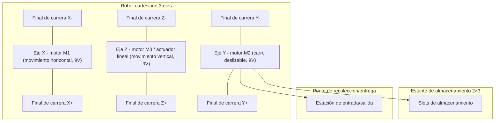
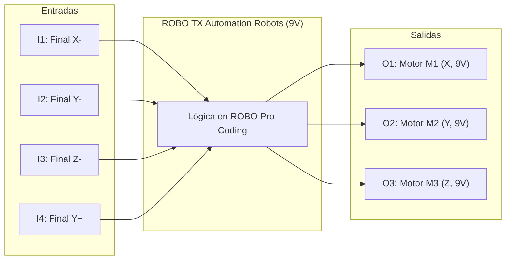
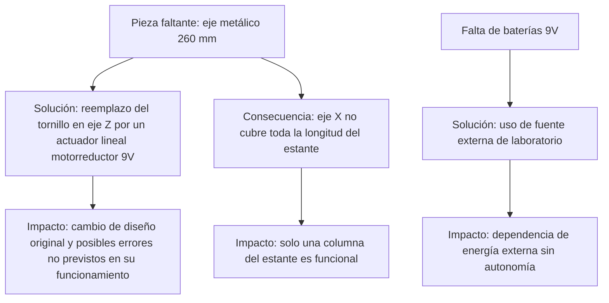
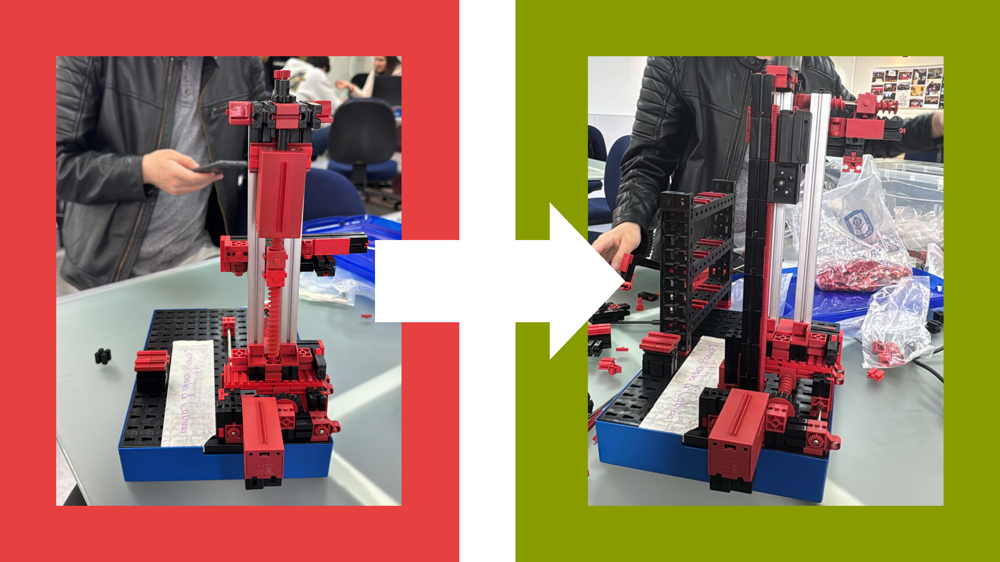
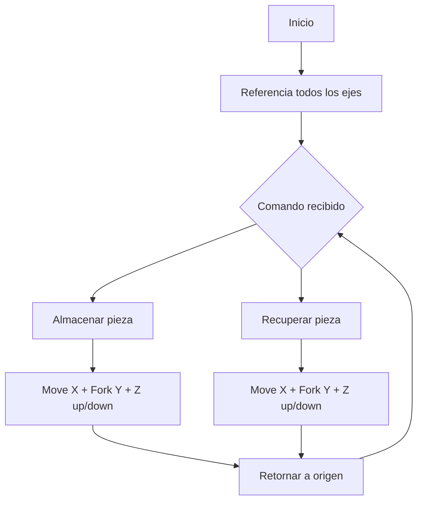
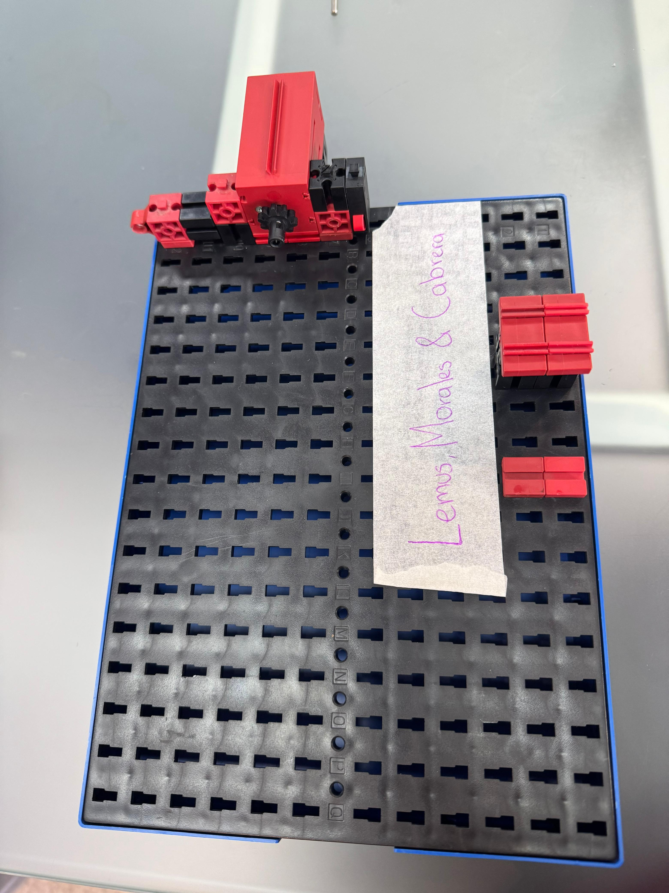
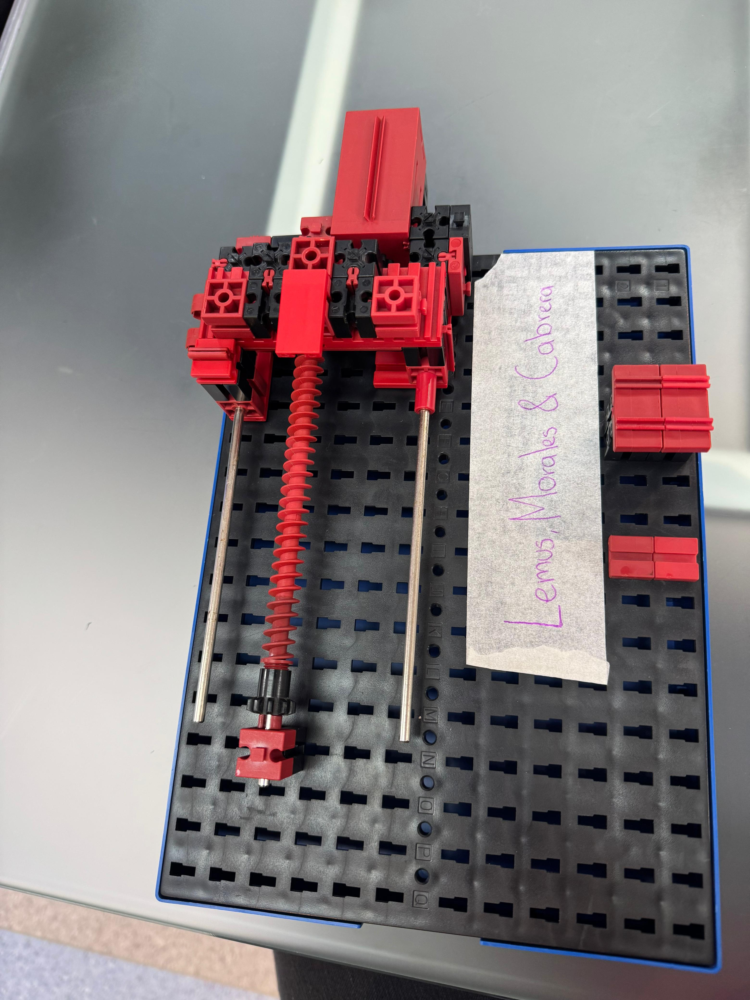
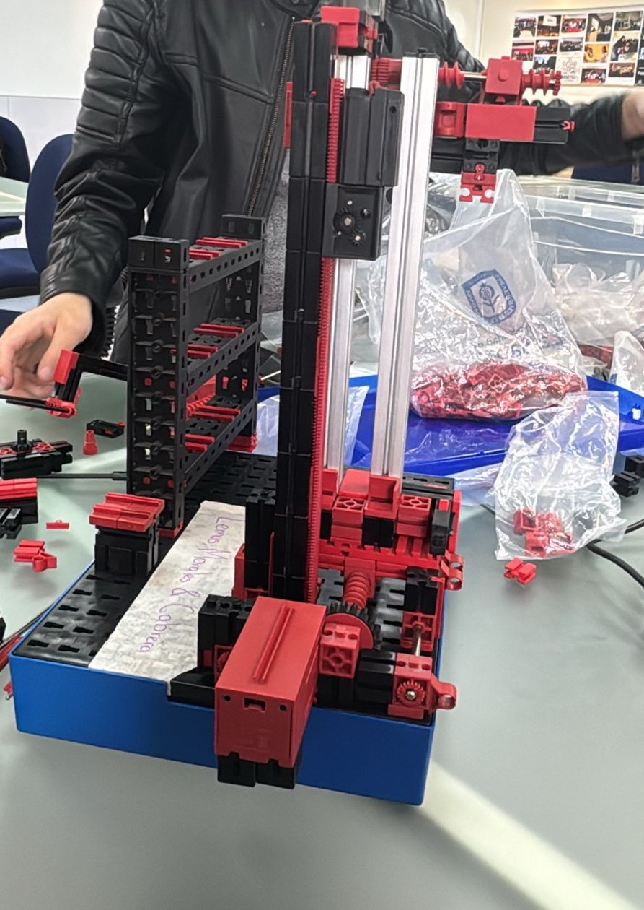
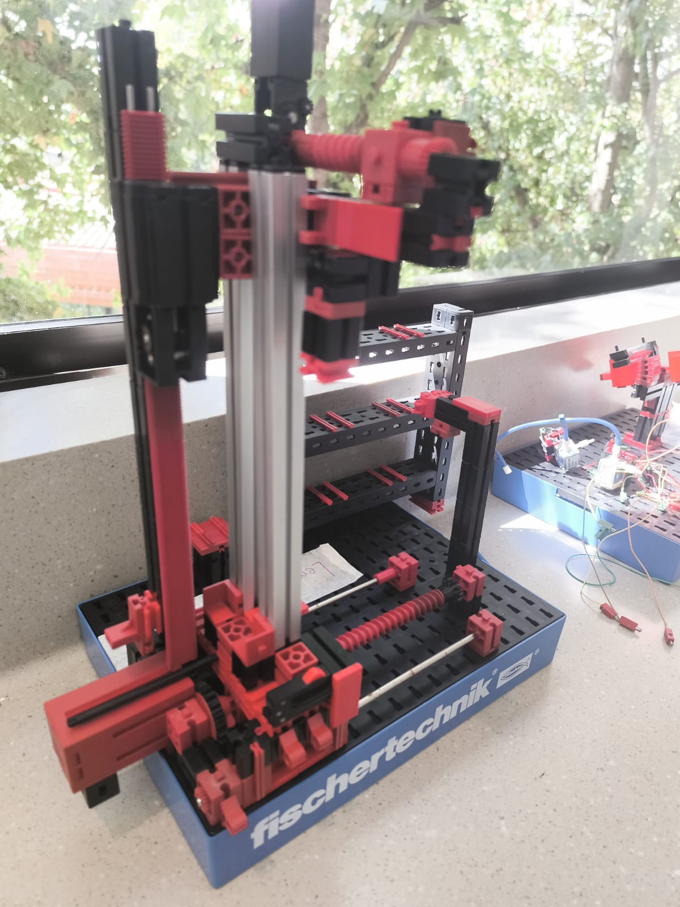

# Proyecto Intermedio #1 – IIoT

## Máquina de Almacenamiento con Robot 3D Fischertechnik

---

## 1. Introducción

### 1.1 Resumen General

Este proyecto corresponde a la **construcción, programación y validación** de un prototipo de máquina de almacenamiento automatizada basado en el modelo **High Bay Storage Rack** de Fischertechnik.

El sistema es un **robot cartesiano de tres ejes (X, Y, Z)** que utiliza un carro deslizable para depositar y recoger piezas en un **estante de 2×3 posiciones**.

Actualmente, por limitaciones de repuestos, se validó solo la **primera columna del estante**, pero el diseño es **escalable** al resto de las posiciones. El control se desarrolló con el **ROBO TX Automation Robots** programado en **ROBO Pro Coding**, gestionando motores a **9 V** y sensores de final de carrera.

### 1.2 Motivación y Justificación

Los sistemas AS/RS (Automated Storage and Retrieval Systems) son esenciales en la logística moderna e Industria 4.0. El presente prototipo permite:

* Comprender la **mecánica de robots cartesianos**.
* Desarrollar **habilidades en control de motores, sensores y rutinas de referencia**.
* Practicar la **resolución de problemas reales de ensamble** frente a restricciones de piezas.
* Integrar hardware y software en un entorno educativo y modular.
* Proyectar soluciones adaptadas a **bajo voltaje (9 V)**, reforzando la seguridad y la escalabilidad con controladores alternativos.

### 1.3 Estructura del Documento

1. Introducción
2. Solución propuesta
3. Configuración experimental, resultados y análisis
4. Programación en ROBO Pro Coding
5. Avances constructivos documentados
6. Autoevaluación
7. Conclusiones y trabajo futuro
8. Lecciones aprendidas
9. Referencias
10. Anexos

---

## 2. Solución Propuesta

### 2.1 Restricciones de Diseño

| Código | Restricción / Requerimiento                      | Tipo          | Impacto |
| -----: | ------------------------------------------------ | ------------- | ------- |
|     R1 | Movimiento cartesiano en 3 ejes (X, Y, Z)        | Funcional     | Alta    |
|     R2 | Operación en **9 V** (no en 24 V industrial)     | Técnica       | Alta    |
|     R3 | Faltan ejes de **260 mm (Art.-No. 107436)**      | Mecánica      | Alta    |
|     R4 | Sustitución de un eje por **actuador lineal**    | Restricción   | Media   |
|     R5 | Adaptación con motorreductores alternativos      | Técnica       | Media   |
|     R6 | Limitación de baterías 9 V para pruebas          | Operativa     | Media   |
|     R7 | Operación solo en la primera columna del estante | Escalabilidad | Media   |
|     R8 | Tiempo de entrega corto                          | Temporal      | Alta    |

---

### 2.2 Arquitectura Física

---

### 2.3 Asignación Hardware–Software (ROBO TX, 9 V)

| Entrada/Salida | Componente          | Función                      |
| -------------- | ------------------- | ---------------------------- |
| I1             | Final de carrera X- | Homing eje X                 |
| I2             | Final de carrera Y- | Homing eje Y                 |
| I3             | Final de carrera Z- | Homing eje Z                 |
| I4             | Final de carrera Y+ | Límite carro (tope superior) |
| O1             | Motor M1 (X, 9 V)   | Movimiento horizontal        |
| O2             | Motor M2 (Y, 9 V)   | Carro deslizable             |
| O3             | Motor M3 (Z, 9 V)   | Actuador lineal vertical     |

---

### 2.4 Criterios de Diseño

* **Modularidad:** cada eje es independiente y ensamblado por etapas.
* **Adaptación:** reemplazo de piezas ausentes por soluciones mecánicas funcionales.
* **Seguridad:** finales de carrera en cada eje para homing.
* **Compatibilidad energética:** todo el sistema trabaja en **9 V**.
* **Escalabilidad:** estante parcial → estante completo al reponer piezas.

---

### 2.5 Retos de Construcción

---

## 3. Configuración Experimental, Resultados y Análisis

### 3.1 Montaje físico

* Ensamble estructural del sistema cartesiano.
* Verificación de homing con finales de carrera.
* Sustitución del tornillo vertical por carril + actuador lineal (9 V).
* Validación de movimientos básicos en X, Y y Z.

---

El reemplazo del tornillo como eje Z por un actuador lineal con motorreductor modificó la arquitectura del prototipo.

*Figura 1. Adaptación del eje Z: de tornillo vertical original a actuador lineal con motorreductor.*

---

¿Quieres que te recompile el **README completo y final** ya con:

* la corrección de pruebas físicas,
* las imágenes de avances integradas,
* la tabla de I/O y lecciones aprendidas,
* y esta nueva sección con el “Antes/Después”?

### 3.2 Pruebas realizadas

1. **Prueba de homing** en X, Y, Z (éxito: 5/5 intentos).
2. **Movimiento individual de ejes** (sin carga).
3. **Ciclo de almacenamiento** en primera columna.
4. **Prueba de estabilidad estructural** (observación de bloqueos y fricción).

**Pruebas propuestas (futuro):**

* Tiempo promedio de ciclo (almacenar/recuperar).
* Tasa de éxito en múltiples repeticiones (mínimo 20 ciclos).
* Registro de fallos mecánicos/electrónicos.

### 3.3 Resultados

* Movimientos X, Y, Z estables con alimentación a 9 V.
* Carro deslizable funcional en operaciones de carga y descarga.
* Se comprobó la capacidad mecánica de ejecutar los movimientos necesarios.
* Aún no se validó el código completo → funcionamiento pendiente de depuración.

---

## 4. Programación en ROBO Pro Coding

Incluye rutinas de referencia, funciones de movimiento y flujo lógico de control.
*(Ver bloque de código completo en `/codes/`)*

---

## 5. Avances Constructivos Documentados

| Fecha      | Imagen                                             | Descripción breve                        |
| ---------- | -------------------------------------------------- | ---------------------------------------- |
| 2025-08-08 |   | Ensamble inicial de la base y eje X.     |
| 2025-08-14 |         | Montaje parcial con validación de ejes.  |
| 2025-08-15 |  | Sustitución del eje 260 mm por actuador. |
| 2025-08-20 |  | Prueba de movimiento de los tres ejes.   |

---

Esto hace que las imágenes se muestren embebidas en el README y no solo como enlaces.

👉 ¿Quieres que te regenere el README completo ya con las imágenes integradas y la corrección de pruebas que comentamos antes (motores probados sin finales de carrera, código aún sin validar)?

---

## 6. Autoevaluación

* **Fortalezas:** ensamble sólido, resolución de problemas prácticos, validación parcial de programación.
* **Debilidades:** operación limitada a 9 V, solo columna 1 activa, código pendiente de prueba.
* **Mejoras:** fuente de alimentación regulada, adquisición de repuestos, depuración del software.

---

## 7. Conclusiones y Trabajo Futuro

El prototipo combina **construcción física adaptativa** y **programación en ROBO Pro Coding**.
Se logró un robot funcional en mecánica, con movimientos básicos y rutinas de referencia en software.

Trabajo futuro:

* Completar estante 2×3.
* Depurar y probar el código completo.
* Migrar de baterías a fuente regulada de 9 V.
* Implementar conectividad IIoT con **ESP32 (3.3 V)** → requiere etapa de **acoplamiento de potencia** a 9 V mediante drivers/MOSFETs.
* Integrar **dashboard en Node-RED** para monitoreo remoto.
* Migrar hacia un **soft-PLC educativo (OpenPLC)** configurado para entornos de bajo voltaje.

---

## 8. Lecciones Aprendidas

1. La **falta de repuestos** obliga a soluciones de ingeniería adaptativa (actuador lineal en Z).
2. El **ensamble físico influye directamente en el software**: errores de fricción o desalineación generan fallos de lógica.
3. La **gestión de energía a 9 V** es crítica: trabajar con baterías limita autonomía y estabilidad, mientras que la fuente externa condiciona portabilidad.
4. Documentar avances y errores desde el inicio facilita la trazabilidad y la futura mejora del sistema.
5. La transición a **smart PLC basados en 3.3 V** demanda prever desde ya la etapa de potencia compatible con actuadores 9 V.

---

## 9. Referencias

* Fischertechnik, *Automation Robots – High Bay Storage Rack*.
* Documentación de **ROBO Pro Coding** y **ROBO TX Automation Robots**.
* ISO/IEC/IEEE 29148:2018 — Requirements engineering.
* IEC 61131 — Estándar para lenguajes de controladores lógicos programables.

---

## 10. Anexos

* Esquemáticos eléctricos: `/docs/esquematico.pdf`
* Códigos ROBO Pro Coding: `/codes/`
* Avances fotográficos: `/media/avances/`
* Videos de funcionamiento: `/media/videos/`

---
