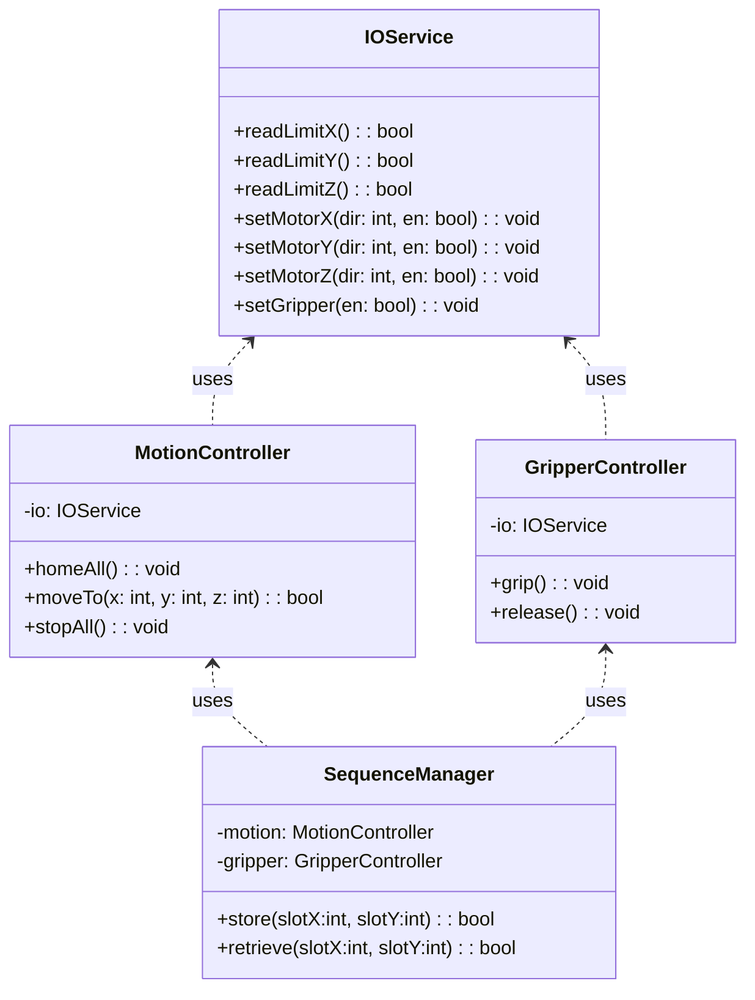
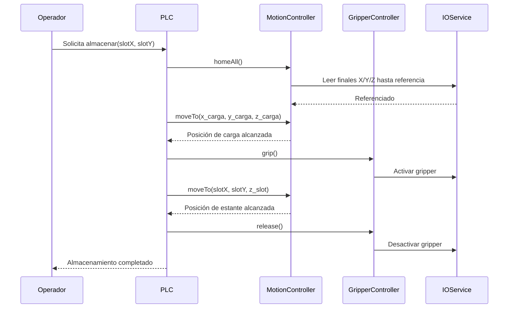
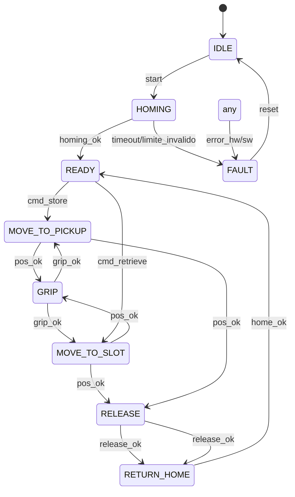

# Proyecto Intermedio #1 – IIoT

## Máquina de Almacenamiento con Brazo 3D Fischertechnik

## 1. Introducción

### 1.1 Resumen General

Este proyecto consiste en el diseño, construcción e implementación de un prototipo de **máquina de almacenamiento automatizada** utilizando el kit **Fischertechnik 3D Robot**. El sistema reproduce un proceso industrial simplificado de manipulación y almacenamiento, operando sobre un estante de 2×3 posiciones, validado en su primera columna.

El prototipo integra percepción básica (finales de carrera), actuación (motores DC con tornillo sin fin y motorreductores) y control mediante PLC 24 V, aplicado al contexto del curso *Internet Industrial de las Cosas (IIoT) – Universidad de La Sabana, 2025-2*.

### 1.2 Motivación y Justificación

Los sistemas de almacenamiento automatizado (AS/RS) mejoran eficiencia, seguridad y trazabilidad. Este prototipo permite entrenar conceptos de automatización e IIoT en un entorno educativo con componentes reales.

### 1.3 Estructura de la Documentación

1. Introducción
2. Solución propuesta
3. Configuración experimental, resultados y análisis
4. Autoevaluación
5. Conclusiones y trabajo futuro
6. Referencias
7. Anexos

---

## 2. Solución Propuesta

### 2.1 Restricciones de Diseño (ISO/IEC/IEEE 29148:2018)

| Código | Requerimiento                   | Tipo          | Prioridad | Descripción                           | Justificación              |
| ------ | ------------------------------- | ------------- | --------- | ------------------------------------- | -------------------------- |
| R1     | Movimiento cartesiano en 3 ejes | Funcional     | Alta      | Posicionamiento en X, Y, Z            | Requisito del proceso      |
| R2     | Manipulación de piezas          | Funcional     | Alta      | Sujeción y liberación seguras         | Almacenamiento confiable   |
| R3     | Control PLC 24 V                | Técnico       | Alta      | Estándar industrial                   | Alineado con formación     |
| R4     | Escalabilidad a 2×3 completo    | Escalabilidad | Media     | Validación inicial en primera columna | Extensible con piezas      |
| R5     | Sustitución de un eje           | Restricción   | Media     | Actuador lineal en reemplazo          | Viabilidad de construcción |
| R6     | Presupuesto limitado            | Económica     | Media     | Uso de componentes disponibles        | Restricción académica      |
| R7     | Volumen de trabajo              | Espacio       | Media     | Montaje en base de madera             | Condiciona carrera útil    |
| R8     | Plazo de entrega                | Temporal      | Alta      | 22/08/2025                            | Acota alcance              |

### 2.2 Arquitectura del Sistema

```mermaid
flowchart TD
    subgraph Percepcion [Percepción]
        LSX[Finales de carrera X]
        LSY[Finales de carrera Y]
        LSZ[Finales de carrera Z]
    end

    subgraph Computo [Computación]
        PLC[PLC 24 V<br/>Ladder Diagram]
    end

    subgraph Actuacion [Actuación]
        MX[Motor DC eje X<br/>tornillo sin fin]
        MY[Motor DC eje Y<br/>motorreductor]
        MZ[Motor DC eje Z<br/>motorreductor/actuador lineal]
        GR[Gripper]
    end

    subgraph Conectividad [Conectividad (futuro)]
        IF1[Modbus/MQTT]
        DB[Dashboard IIoT]
    end

    LSX --> PLC
    LSY --> PLC
    LSZ --> PLC

    PLC --> MX
    PLC --> MY
    PLC --> MZ
    PLC --> GR

    PLC --- IF1
    IF1 --- DB
```

### 2.3 Criterios de Diseño

* Modularidad: ejes X, Y, Z y gripper como subsistemas independientes.
* Robustez: finales de carrera para homing, límites y seguridad.
* Escalabilidad: ampliación a estante 2×3 completo con componentes adicionales.
* Mantenibilidad: separación clara entre lógica de secuencias y servicios de E/S.

### 2.4 UML (estructura lógica del software PLC)

#### 2.4.1 Diagrama de Clases (vista modular de control)



#### 2.4.2 Diagrama de Secuencia (operación “almacenar pieza”)



#### 2.4.3 Diagrama de Estados (ciclo de control)



### 2.5 Esquemáticos de Hardware

Los esquemáticos eléctricos y de conexión de finales de carrera y motores deben adjuntarse en `/docs/esquematico.pdf`.

### 2.6 Estándares de Ingeniería Aplicados

* ISO/IEC/IEEE 29148:2018 para especificación de requisitos.
* Buenas prácticas de documentación técnica estilo IEEE (secciones numeradas, referencias).
* Consideraciones de seguridad eléctrica en 24 V DC.

---

## 3. Configuración Experimental, Resultados y Análisis

### 3.1 Protocolo de Pruebas

1. Homing con finales de carrera en X, Y, Z.
2. Ciclo de toma y depósito en primera columna.
3. Recuperación de pieza desde posición asignada.
4. Repetición de ciclos para verificar estabilidad y repetibilidad.

### 3.2 Resultados

* Posicionamiento estable en X, Y, Z.
* Manipulación confiable con gripper en cargas de laboratorio.
* Operación validada en primera columna del estante.

### 3.3 Análisis

El prototipo cumple los objetivos de almacenamiento y recuperación. La sustitución de un eje por actuador lineal asegura viabilidad sin comprometer la funcionalidad nuclear. La escalabilidad al estante completo depende de completar el kit mecánico.

---

## 4. Autoevaluación del Protocolo de Pruebas

* Fortalezas: construcción robusta, seguridad por finales de carrera, lógica modular.
* Debilidades: conectividad IIoT aún no desplegada; cobertura parcial del estante.
* Mejoras: añadir métricas automáticas (tiempo de ciclo, tasa de éxito), y manejo de fallos más granular.

---

## 5. Conclusiones y Trabajo Futuro

Se construyó un prototipo funcional de máquina de almacenamiento con control PLC y percepción por finales de carrera. El diseño modular facilita mantenimiento y escalabilidad.
Trabajo futuro: completar 2×3, cargar/optimizar programa PLC, integrar Modbus/MQTT con dashboard (Node-RED) y registrar métricas de desempeño.

---

## 6. Referencias

* Fischertechnik, “PLC programming.”
* ISO/IEC/IEEE 29148:2018 — Requirements engineering.
* Literatura técnica sobre AS/RS e integración IIoT en logística.

---

## 7. Anexos

* Código PLC: `/src/programa_plc.lad`
* UML Mermaid: en este `README.md`
* Esquemáticos: `/docs/esquematico.pdf`
* Protocolo de pruebas: `/tests/protocolo_pruebas.md`
* Presentación de sustentación: `/media/presentacion.pdf`

Nota: La demostración se realizará en presentación presencial; no se incluye video.

---
