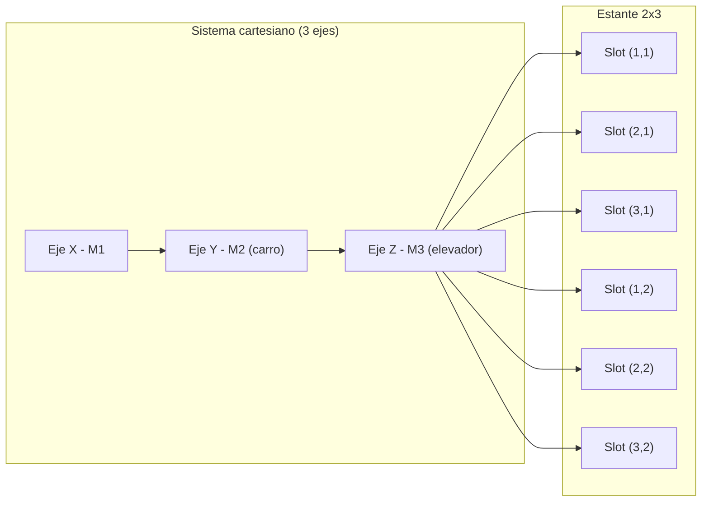
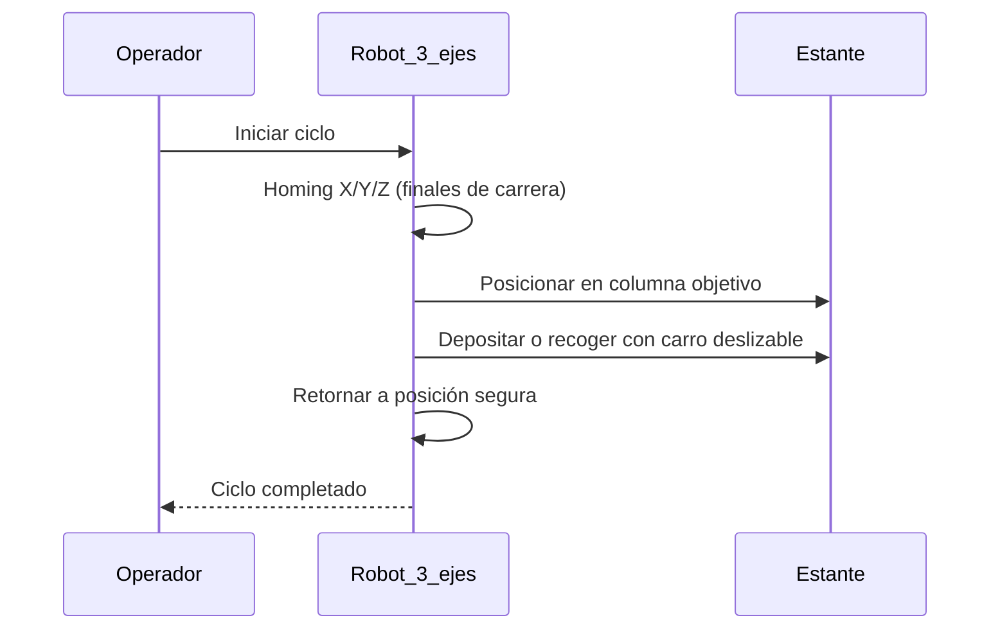
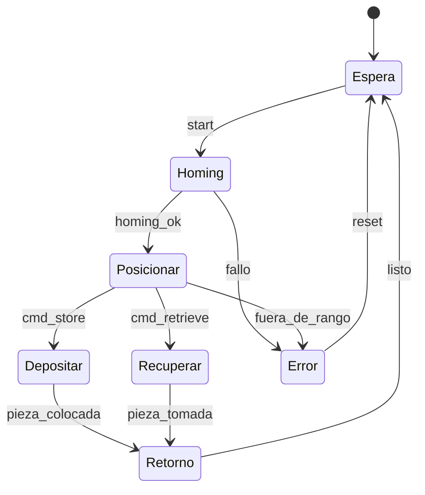

Aquí tienes el `README.md` completo, corregido y adaptado a tu máquina real (3 ejes, carro deslizable sin actuador de pinza), con **diagramas Mermaid físicos** que renderizan en GitHub y sin lógica de PLC. Todos los bloques de código están cerrados correctamente.

---

# Proyecto Intermedio #1 – IIoT

## Máquina de Almacenamiento con Brazo 3D Fischertechnik

## 1. Introducción

### 1.1 Resumen General

Este proyecto consiste en el diseño, construcción e implementación de un prototipo de **máquina de almacenamiento automatizada** utilizando el kit **Fischertechnik 3D Robot**. El sistema reproduce un proceso industrial simplificado de manipulación y almacenamiento sobre un estante de 2×3 posiciones, validado en su primera columna.

El prototipo integra **finales de carrera** como percepción básica, **motores DC con tornillo y motorreductores** en tres ejes (X, Y, Z) y **control mediante PLC 24 V**, en el marco del curso *Internet Industrial de las Cosas (IIoT) – Universidad de La Sabana, 2025-2*.

### 1.2 Motivación y Justificación

Los sistemas AS/RS incrementan eficiencia, seguridad y trazabilidad. Este prototipo permite entrenar principios de automatización e IIoT en un entorno educativo con componentes industriales y restricciones reales de ingeniería.

### 1.3 Estructura de la Documentación

1. Introducción
2. Solución propuesta
3. Configuración experimental, resultados y análisis
4. Autoevaluación
5. Conclusiones y trabajo futuro
6. Referencias
7. Anexos

---

## 2. Solución Propuesta

### 2.1 Restricciones de Diseño (ISO/IEC/IEEE 29148:2018)

| Código | Requerimiento                        | Tipo          | Prioridad | Descripción                                     | Justificación              |
| -----: | ------------------------------------ | ------------- | --------- | ----------------------------------------------- | -------------------------- |
|     R1 | Movimiento cartesiano en 3 ejes      | Funcional     | Alta      | Posicionamiento en X, Y, Z                      | Requisito del proceso      |
|     R2 | Manipulación sin actuador de pinza   | Funcional     | Alta      | Depósito/recogida mediante **carro deslizable** | Simplicidad y robustez     |
|     R3 | Control con PLC 24 V                 | Técnico       | Alta      | Estándar industrial                             | Alineado con formación     |
|     R4 | Escalabilidad a estante 2×3 completo | Escalabilidad | Media     | Validación inicial en primera columna           | Extensible con repuestos   |
|     R5 | Sustitución de un eje                | Restricción   | Media     | Uso de **actuador lineal** en un eje            | Viabilidad de construcción |
|     R6 | Presupuesto limitado                 | Económica     | Media     | Uso de componentes disponibles                  | Restricción académica      |
|     R7 | Volumen de trabajo                   | Espacio       | Media     | Montaje sobre base de madera                    | Condiciona carrera útil    |
|     R8 | Plazo de entrega                     | Temporal      | Alta      | 22/08/2025                                      | Acota alcance              |

### 2.2 Arquitectura del Sistema (vista física)

Conectividad prevista (no incluida en el diagrama): integración futura Modbus/MQTT hacia un dashboard IIoT.

### 2.3 Criterios de Diseño

* **Modularidad:** ejes X, Y, Z y estante como subsistemas.
* **Robustez:** homing y límites con finales de carrera.
* **Escalabilidad:** ampliación a estante 2×3 completo al disponer de piezas.
* **Mantenibilidad:** separación de cableado por ejes y rutas accesibles.

### 2.4 Diagramas de la Solución (Mermaid, vista física)

#### 2.4.1 Flujo de operación

#### 2.4.2 Estados de operación

### 2.5 Esquemáticos y Asignación de E/S

* **Entradas (I1–I6):** finales de carrera para X−/X+, Y−/Y+, Z−/Z+ (asignación sugerida).
* **Salidas (M1–M3):** motores de los ejes X, Y y Z.
* Esquemático eléctrico y rutas de cableado en `/docs/esquematico.pdf`.

### 2.6 Estándares de Ingeniería Aplicados

* **ISO/IEC/IEEE 29148:2018** para especificación de requisitos.
* Buenas prácticas de documentación técnica (estructura numerada, referencias).
* Consideraciones de seguridad en **24 V DC** (protecciones, gestión de cableado y fijación).

---

## 3. Configuración Experimental, Resultados y Análisis

### 3.1 Protocolo de Pruebas

1. Homing con finales de carrera en X, Y, Z.
2. Ciclo de depósito en primera columna del estante.
3. Ciclo de recuperación desde posición asignada.
4. Repetición de ciclos para evaluar estabilidad y repetibilidad.

### 3.2 Resultados

* Posicionamiento estable en X, Y, Z.
* Depósito/recogida mediante **carro deslizable** operativo y consistente.
* Operación validada en la primera columna del estante (capacidad parcial).

### 3.3 Análisis

El prototipo cumple los objetivos de almacenamiento y recuperación con la arquitectura de 3 ejes y carro sin actuador de pinza. La sustitución por actuador lineal mantiene la viabilidad del diseño. La escalabilidad al 2×3 completo depende de la disponibilidad de repuestos mecánicos.

---

## 4. Autoevaluación del Protocolo de Pruebas

* **Fortalezas:** construcción robusta, seguridad por finales de carrera, diseño modular físico.
* **Debilidades:** conectividad IIoT aún no desplegada; cobertura parcial del estante.
* **Mejoras:** instrumentar métricas automáticas (tiempo de ciclo, tasa de éxito); definir tolerancias de posicionamiento; manejo de fallos más granular.

---

## 5. Conclusiones y Trabajo Futuro

Se construyó un prototipo funcional de máquina de almacenamiento de **tres ejes** con carro deslizable y control 24 V. El diseño es mantenible y escalable.
Trabajo futuro: completar operación 2×3, carga/optimización del programa del PLC, integración Modbus/MQTT con dashboard (Node-RED) y registro de métricas de desempeño.

---

## 6. Referencias

* Fischertechnik, documentación de automatización y 3D Robot.
* ISO/IEC/IEEE 29148:2018 — Requirements engineering.
* Literatura técnica sobre AS/RS e integración IIoT en logística.

---

## 7. Anexos

* Código PLC: `/src/programa_plc.lad`
* Diagramas Mermaid: en este `README.md`
* Esquemáticos: `/docs/esquematico.pdf`
* Protocolo de pruebas: `/tests/protocolo_pruebas.md`
* Presentación de sustentación: `/media/presentacion.pdf`

**Nota:** La validación se realizará en presentación presencial; no se incluye video.

---
