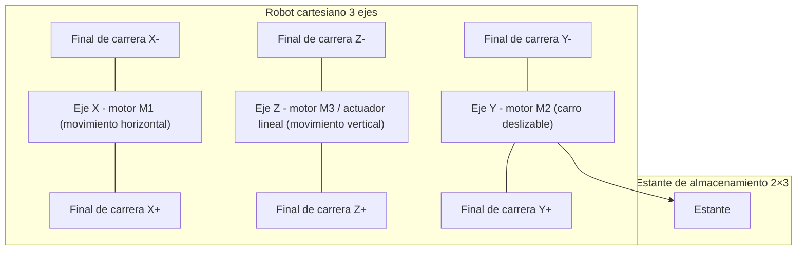
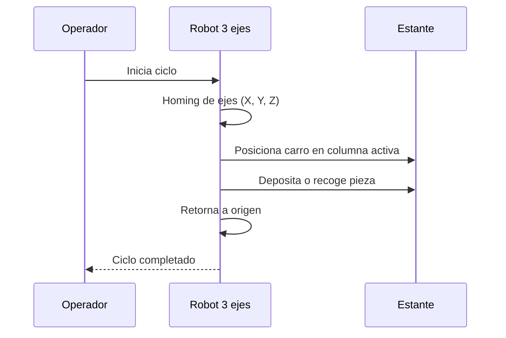
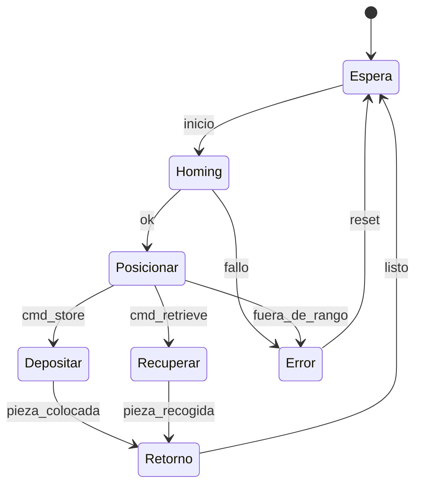
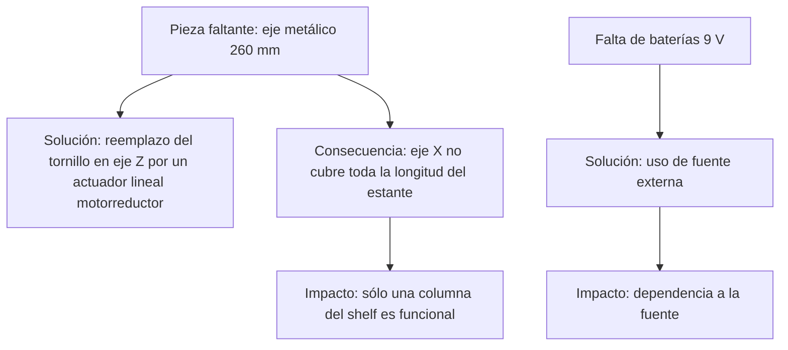

# Proyecto Intermedio #1 – IIoT

## Máquina de Almacenamiento con Robot 3D Fischertechnik

---

## 1. Introducción

### 1.1 Resumen General

Este proyecto corresponde a la **construcción y validación** de un prototipo de máquina de almacenamiento automatizada basado en el modelo **High Bay Storage Rack** de Fischertechnik.
El sistema es un **robot cartesiano de tres ejes (X, Y, Z)** que utiliza un carro deslizable para depositar y recoger piezas en un **estante de 2×3 posiciones**.

Actualmente, por limitaciones de repuestos, se validó solo la **primera columna del estante**, pero el diseño es **escalable** al resto de las posiciones.

### 1.2 Motivación y Justificación

Los sistemas AS/RS son esenciales en la logística moderna. El presente prototipo permite:

* Entender en detalle la **mecánica de robots cartesianos**.
* Practicar la **resolución de problemas reales de ensamble**.
* Demostrar cómo las restricciones materiales y energéticas impactan el diseño.
* Sentar bases para un **control lógico futuro con PLC**.

### 1.3 Estructura del Documento

1. Introducción
2. Solución propuesta
3. Configuración experimental, resultados y análisis
4. Avances constructivos documentados
5. Autoevaluación
6. Conclusiones y trabajo futuro
7. Referencias
8. Anexos

---

## 2. Solución Propuesta

### 2.1 Restricciones de Diseño

| Código | Restricción / Requerimiento                        | Tipo          | Impacto |
| -----: | -------------------------------------------------- | ------------- | ------- |
|     R1 | Movimiento cartesiano en 3 ejes (X, Y, Z)          | Funcional     | Alta    |
|     R2 | Operación en **9 V** (no 24 V estándar industrial) | Técnica       | Alta    |
|     R3 | Faltan ejes de **260 mm (Art.-No. 107436)**        | Mecánica      | Alta    |
|     R4 | Sustitución de un eje por **actuador lineal**      | Restricción   | Media   |
|     R5 | Adaptación con motorreductores alternativos        | Técnica       | Media   |
|     R6 | Limitación de baterías 9 V para pruebas            | Operativa     | Media   |
|     R7 | Operación solo en la primera columna del estante   | Escalabilidad | Media   |
|     R8 | Tiempo de entrega corto                            | Temporal      | Alta    |

---

### 2.2 Arquitectura Física

---

### 2.3 Criterios de Diseño

* **Modularidad:** cada eje es independiente y ensamblado por etapas.
* **Adaptación:** reemplazo de piezas ausentes por soluciones mecánicas funcionales.
* **Seguridad:** finales de carrera en cada eje para homing.
* **Energía:** compatibilidad con 9 V por limitaciones de fuente.
* **Escalabilidad:** estante parcial → estante completo al reponer piezas.

---

### 2.4 Diagramas de Operación

#### Flujo de operación básico

#### Estados del sistema

---

### 2.5 Problemas y Soluciones de Ingeniería

---

## 3. Configuración Experimental, Resultados y Análisis

### 3.1 Protocolo de Pruebas

1. Ensamble estructural del sistema cartesiano.
2. Verificación de homing con finales de carrera.
3. Movimiento individual en X, Y y Z.
4. Prueba de ciclo de almacenamiento en primera columna.
5. Observación de estabilidad y repetibilidad.

### 3.2 Resultados

* Movimientos X, Y, Z estables con alimentación a 9 V.
* Carro deslizable funcional en operaciones de carga y descarga.
* Ciclos completos en primera columna.
* Limitaciones en autonomía (baterías).

### 3.3 Análisis

El modelo es **funcional a escala** y cumple con la función principal de almacenamiento/recuperación. La falta de repuestos obligó a soluciones adaptativas, que demostraron ser viables. La ampliación dependerá de la reposición de piezas originales.

---

## 4. Avances Constructivos Documentados

**Nota:** en esta sección se adjuntarán fotos con fecha de avance.
Formato sugerido:

* `media/avance_YYYYMMDD.jpg` → descripción breve.

Ejemplo de tabla:

| Fecha      | Imagen                      | Descripción breve                        |
| ---------- | --------------------------- | ---------------------------------------- |
| 2025-08-01 | `media/avance_20250801.jpg` | Ensamble inicial de la base y eje X.     |
| 2025-08-05 | `media/avance_20250805.jpg` | Montaje del carro deslizable (eje Y).    |
| 2025-08-10 | `media/avance_20250810.jpg` | Sustitución del eje 260 mm por actuador. |
| 2025-08-15 | `media/avance_20250815.jpg` | Validación de movimientos con 9 V.       |

---

## 5. Autoevaluación

* **Fortalezas:** ensamble sólido, resolución de problemas prácticos, validación experimental parcial.
* **Debilidades:** operación limitada a 9 V, solo columna 1 activa, autonomía baja.
* **Mejoras:** fuente de alimentación estable, adquisición de repuestos, integración lógica.

---

## 6. Conclusiones y Trabajo Futuro

Se construyó un prototipo funcional del sistema AS/RS de tres ejes, operando a 9 V.
El proyecto demostró la importancia de la **ingeniería adaptativa** frente a la falta de repuestos y energía.

Trabajo futuro:

* Completar estante 2×3.
* Migrar a fuente regulada en lugar de baterías.
* Implementar lógica de control en PLC.
* Medir métricas de desempeño.

---

## 7. Referencias

* Fischertechnik, *Automation Robots – High Bay Storage Rack* (manual técnico).
* ISO/IEC/IEEE 29148:2018 — Requirements engineering.
* Bibliografía sobre AS/RS y automatización educativa.

---

## 8. Anexos

* Esquemáticos eléctricos: `/docs/esquematico.pdf`
* Protocolo de pruebas: `/tests/protocolo_pruebas.md`
* Avances fotográficos: `/media/avance_YYYYMMDD.jpg`
* Presentación de sustentación: `/media/presentacion.pdf`
