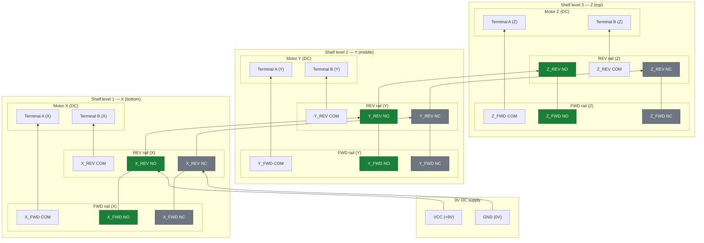

# Proyecto Intermedio – IIoT
## PARTES:
1. [PRIMER CORTE](https://github.com/SB-312/Proyecto-Intermedio-IIoT/tree/916e029ec4225949f1034e62b44dfbe654ede8cd/PRIMER%20CORTE)
2. [SEGUNDO CORTE](https://github.com/SB-312/Proyecto-Intermedio-IIoT/tree/916e029ec4225949f1034e62b44dfbe654ede8cd/SEGUNDO%20CORTE)

```mermaid

flowchart BT

%% === PSU (feeds Level X only) ===
subgraph PSU["9V DC supply"]
  VCC0["VCC (+9V)"]
  GND0["GND (0V)"]
end

%% === LEVEL 3 — Z (top) ===
subgraph L3["Shelf level 3 — Z (top)"]
  direction LR
  subgraph ZREV["REV rail (Z)"]
    direction TB
    Z_REV_NO["Z_REV NO"]
    Z_REV_COM["Z_REV COM"]
    Z_REV_NC["Z_REV NC"]
  end
  subgraph ZFWD["FWD rail (Z)"]
    direction TB
    Z_FWD_NO["Z_FWD NO"]
    Z_FWD_COM["Z_FWD COM"]
    Z_FWD_NC["Z_FWD NC"]
  end
  subgraph ZM["Motor Z (DC)"]
    direction TB
    Z_A["Terminal A (Z)"]
    Z_B["Terminal B (Z)"]
  end
  %% FWD takes from REV at same level
  Z_FWD_NO --- Z_REV_NO
  Z_FWD_NC --- Z_REV_NC
  %% COMs to motor
  Z_FWD_COM --> Z_A
  Z_REV_COM --> Z_B
end

%% === LEVEL 2 — Y (middle) ===
subgraph L2["Shelf level 2 — Y (middle)"]
  direction LR
  subgraph YREV["REV rail (Y)"]
    direction TB
    Y_REV_NO["Y_REV NO"]
    Y_REV_COM["Y_REV COM"]
    Y_REV_NC["Y_REV NC"]
  end
  subgraph YFWD["FWD rail (Y)"]
    direction TB
    Y_FWD_NO["Y_FWD NO"]
    Y_FWD_COM["Y_FWD COM"]
    Y_FWD_NC["Y_FWD NC"]
  end
  subgraph YM["Motor Y (DC)"]
    direction TB
    Y_A["Terminal A (Y)"]
    Y_B["Terminal B (Y)"]
  end
  Y_FWD_NO --- Y_REV_NO
  Y_FWD_NC --- Y_REV_NC
  Y_FWD_COM --> Y_A
  Y_REV_COM --> Y_B
end

%% === LEVEL 1 — X (bottom) ===
subgraph L1["Shelf level 1 — X (bottom)"]
  direction LR
  subgraph XREV["REV rail (X)"]
    direction TB
    X_REV_NO["X_REV NO"]
    X_REV_COM["X_REV COM"]
    X_REV_NC["X_REV NC"]
  end
  subgraph XFWD["FWD rail (X)"]
    direction TB
    X_FWD_NO["X_FWD NO"]
    X_FWD_COM["X_FWD COM"]
    X_FWD_NC["X_FWD NC"]
  end
  subgraph XM["Motor X (DC)"]
    direction TB
    X_A["Terminal A (X)"]
    X_B["Terminal B (X)"]
  end
  X_FWD_NO --- X_REV_NO
  X_FWD_NC --- X_REV_NC
  X_FWD_COM --> X_A
  X_REV_COM --> X_B
end

%% === PSU → Level X only; then VCC/GND climb on the REV side ===
VCC0 --> X_REV_NO
GND0 --> X_REV_NC
X_REV_NO --> Y_REV_NO --> Z_REV_NO
X_REV_NC --> Y_REV_NC --> Z_REV_NC

%% === Optional node styling for quick orientation ===
classDef vcc fill:#1a7f37,stroke:#0e4429,color:#fff;
classDef gnd fill:#6e7781,stroke:#24292f,color:#fff;
class X_REV_NO,Y_REV_NO,Z_REV_NO,X_FWD_NO,Y_FWD_NO,Z_FWD_NO vcc;
class X_REV_NC,Y_REV_NC,Z_REV_NC,X_FWD_NC,Y_FWD_NC,Z_FWD_NC gnd;


```
