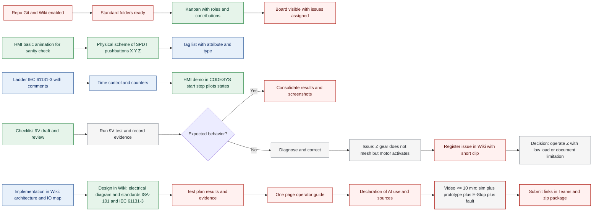
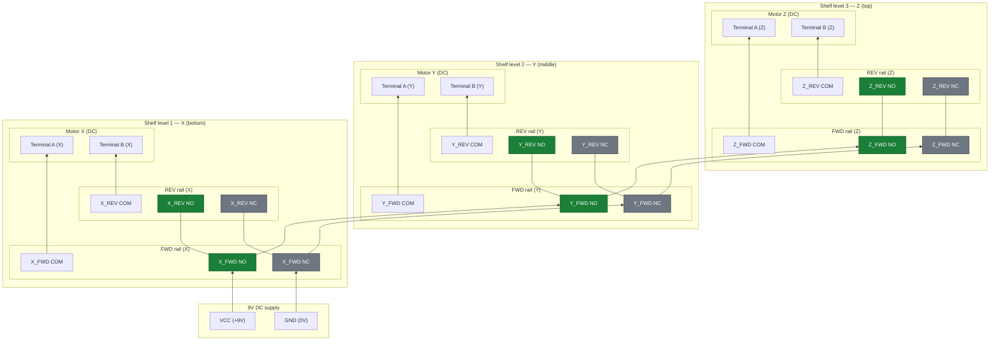
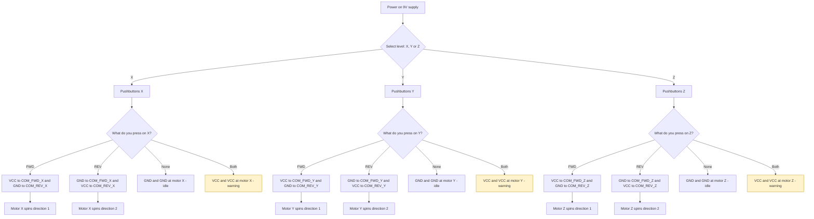

# Contexto y Requisitos
Este trabajo tiene como objetivo el continuar con la implementacion del proceso descrito en la primera parte de este proyecto, en este caso seria un brazo robot que transportaria cargas desde la bahia al almacen y viceversa. Para ello en este trabajo se hablara de como se conecto el prototipo de manera que es manejable por medio de botones si esta siendo alimentado por nueve voltios y ademas de una simulacion hecha en codesys con el uso de logica ladder la cual representa de manera fiel el funcionamiento mecanico del prototipo en la vida real.

En este caso se debe utilizar un PLC simulado dentro de codesys que utilice una logica ladder la cual tiene que hacer uso de contadores y timers para lograr representar el funcionamiento del prototipo el proceso sera llevado a cabo por medio de interruptores que son accionadas por medio de la HMI, el proceso debe tener luces piloto que muestren al operador como van cambiando los estados del proceso y tambien si hay alguna anomalia durante el mismo. Este HMI debe mostrar animaciones de como se desarrollaria el proceso con el prototipo real mientras el operador manipula los interruptores para ponerlo en funcionamiento o detenerlo si asi lo desea.

## 1) Roles y Contribuciones

| Categoría             | Criterio                                                                 | Responsable |
|-----------------------|---------------------------------------------------------------------------|-------------|
| Gestión de proyecto   | Repositorio Git creado                                                    | Maria Alejandra Cabrera Arauz   |
| Gestión de proyecto   | Estructura de carpetas estandarizada (src/ hmi/ docs/ proto/ video/)      | Maria Alejandra Cabrera Arauz   |
| Gestión de proyecto   | Tablero con Roles y contribuciones por integrante                         | Juan Diego Lemus Rey       |
| Gestión de proyecto   | Visualización del tablero, roles y contribuciones                        | Maria Alejandra Cabrera Arauz   |
| Diseño ingenieril     | Diagrama eléctrico completo (sensores/actuadores ↔ PLC)                  | Juan Diego Lemus Rey       |
| Diseño ingenieril     | Lista de variables (tag list) con atributo y tipo                        | Christian Daniel Morales Jimenez   |
| Diseño ingenieril     | Diagrama de actividades/secuencial del proceso                           | Juan Diego Lemus Rey       |
| Diseño ingenieril     | Ladder conforme IEC 61131-3 con comentarios por red                      | Christian Daniel Morales Jimenez   |
| Diseño ingenieril     | Control por tiempo (temporizadores, estados, transiciones) implementado  | Christian Daniel Morales Jimenez   |
| Validación prototipo  | Diseño de checklist 9V                                                   | Juan Diego Lemus Rey       |
| Validación simulación | Demostración HMI en CODESYS (start/stop, E-Stop, pilotos, estados)       | Christian Daniel Morales Jimenez   |
| HMI (ISA-101)         | Animación simulación 3D                                                  | Juan Diego Lemus Rey       |
| HMI (ISA-101)         | Pantalla principal (estados)                                             | Christian Daniel Morales Jimenez   |
| HMI (Comunic.)        | Guía de 1 página para el operador                                        | Maria Alejandra Cabrera Arauz   |
| Wiki técnica          | Sección Contexto y requisitos (cita Enunciado)                           | Christian Daniel Morales Jimenez   |
| Wiki técnica          | Diagrama(s), criterios, restricciones, estándares aplicados              | Juan Diego Lemus Rey       |
| Wiki técnica          | Arquitectura CODESYS, mapeo de direcciones, Ladder comentado             | Christian Daniel Morales Jimenez   |
| Wiki técnica          | Plan de pruebas, resultados, evidencias (sim y prototipo)                | Maria Alejandra Cabrera Arauz   |
| Wiki técnica          | Declaración del uso de IA y fuentes bibliográficas                       | Maria Alejandra Cabrera Arauz   |
| Video (≤10 min)       | Demostración y explicación clara (sim + prototipo + E-Stop + anomalía)   | Todos       |

## 2) Diagrama de actividades

---

## 3) Diagrama Eléctrico

---
## 4) Diagrama de usabilidad

---

# Documentación de variables en codesys

| **Nombre**      | **Tipo de dato** | **Función (I/O/Interno/Timer/Contador)** | **Descripción** |
|-----------------|------------------|------------------------------------------|-----------------|
| **Movement_X**  | INT              | Interno                                  | Posición actual del eje X (0–176). |
| **Movement_Y**  | INT              | Interno                                  | Posición actual del eje Y (0–176). |
| **Movement_Z**  | INT              | Interno                                  | Posición actual del eje Z (0–176). |
| **CountUp_x**   | INT              | Interno                                  | Conteo de incrementos en eje X. |
| **CountD_x**    | INT              | Interno                                  | Conteo de decrementos en eje X. |
| **CountUp_y**   | INT              | Interno                                  | Conteo de incrementos en eje Y. |
| **CountD_y**    | INT              | Interno                                  | Conteo de decrementos en eje Y. |
| **CountUp_z**   | INT              | Interno                                  | Conteo de incrementos en eje Z. |
| **CountD_z**    | INT              | Interno                                  | Conteo de decrementos en eje Z. |
| **Flanco_ax**   | BOOL             | Interno (Relay)                          | Flanco de avance en eje X (detector de pulso). |
| **Flanco_bx**   | BOOL             | Interno (Relay)                          | Flanco de retroceso en eje X. |
| **Flanco_ay**   | BOOL             | Interno (Relay)                          | Flanco de avance en eje Y. |
| **Flanco_by**   | BOOL             | Interno (Relay)                          | Flanco de retroceso en eje Y. |
| **Flanco_az**   | BOOL             | Interno (Relay)                          | Flanco de avance en eje Z. |
| **Flanco_bz**   | BOOL             | Interno (Relay)                          | Flanco de retroceso en eje Z. |
| **Power_light** | BOOL             | Salida                                   | Indicador luminoso de encendido del sistema. |
| **Power_on**    | BOOL             | Entrada                                  | Interruptor general de encendido. |
| **Error**       | BOOL             | Salida                                   | Señal de error general (colisión o doble orden). |
| **Advance_x**   | BOOL             | Entrada                                  | Orden de avance en eje X (desde HMI o pulsador). |
| **Advance_y**   | BOOL             | Entrada                                  | Orden de avance en eje Y. |
| **Advance_z**   | BOOL             | Entrada                                  | Orden de avance en eje Z. |
| **Back_x**      | BOOL             | Entrada                                  | Orden de retroceso en eje X. |
| **Back_y**      | BOOL             | Entrada                                  | Orden de retroceso en eje Y. |
| **Back_z**      | BOOL             | Entrada                                  | Orden de retroceso en eje Z. |
| **Stop**        | BOOL             | Entrada                                  | Botón de paro para detener el proceso. |
| **Limit_ax**    | BOOL             | Entrada (Sensor)                         | Sensor de límite superior en eje X. |
| **Limit_bx**    | BOOL             | Entrada (Sensor)                         | Sensor de límite inferior en eje X. |
| **Limit_ay**    | BOOL             | Entrada (Sensor)                         | Sensor de límite superior en eje Y. |
| **Limit_by**    | BOOL             | Entrada (Sensor)                         | Sensor de límite inferior en eje Y. |
| **Limit_az**    | BOOL             | Entrada (Sensor)                         | Sensor de límite superior en eje Z. |
| **Limit_bz**    | BOOL             | Entrada (Sensor)                         | Sensor de límite inferior en eje Z. |
| **Lamp_ax**     | BOOL             | Salida                                   | Lámpara de estado avance eje X. |
| **Lamp_bx**     | BOOL             | Salida                                   | Lámpara de estado retroceso eje X. |
| **Lamp_ay**     | BOOL             | Salida                                   | Lámpara de estado avance eje Y. |
| **Lamp_by**     | BOOL             | Salida                                   | Lámpara de estado retroceso eje Y. |
| **Lamp_az**     | BOOL             | Salida                                   | Lámpara de estado avance eje Z. |
| **Lamp_bz**     | BOOL             | Salida                                   | Lámpara de estado retroceso eje Z. |
| **Ton_ax**      | TON              | Timer                                    | Temporizador para avance eje X. |
| **Ton_bx**      | TON              | Timer                                    | Temporizador para retroceso eje X. |
| **Ton_ay**      | TON              | Timer                                    | Temporizador para avance eje Y. |
| **Ton_by**      | TON              | Timer                                    | Temporizador para retroceso eje Y. |
| **Ton_az**      | TON              | Timer                                    | Temporizador para avance eje Z. |
| **Ton_bz**      | TON              | Timer                                    | Temporizador para retroceso eje Z. |
| **Cont_ax**     | CTU              | Contador                                 | Contador de pasos avance eje X. |
| **Cont_bx**     | CTU              | Contador                                 | Contador de pasos retroceso eje X. |
| **Cont_ay**     | CTU              | Contador                                 | Contador de pasos avance eje Y. |
| **Cont_by**     | CTU              | Contador                                 | Contador de pasos retroceso eje Y. |
| **Cont_az**     | CTU              | Contador                                 | Contador de pasos avance eje Z. |
| **Cont_bz**     | CTU              | Contador                                 | Contador de pasos retroceso eje Z. |
| **Time_ax**     | TIME             | Interno (Tiempo)                         | Tiempo configurado para avance eje X. |
| **Time_bx**     | TIME             | Interno (Tiempo)                         | Tiempo configurado para retroceso eje X. |
| **Time_ay**     | TIME             | Interno (Tiempo)                         | Tiempo configurado para avance eje Y. |
| **Time_by**     | TIME             | Interno (Tiempo)                         | Tiempo configurado para retroceso eje Y. |
| **Time_az**     | TIME             | Interno (Tiempo)                         | Tiempo configurado para avance eje Z. |
| **Time_bz**     | TIME             | Interno (Tiempo)                         | Tiempo configurado para retroceso eje Z. |

# Logica ladder

## Funcion de encendido

Esta parte de la logica solo se necarga de controlar el estado de la variable "Power_on" y la luz de encendido que depende de esta variable.

## Funciones de movimiento
## Funciones de avance

Esta función consta de un AND de 5 entradas, siendo estas "Power_on" (encendido), la variable de avance en este caso como en el ejemplo es el eje x "Advance_x", "Flanco_ax" la cual depende de la salida del timer esto se hizo con el proposito de que se de flanco a si mismo para crear una animacion fluida, "Error" la cual en caso de que haya una anomalia en el proceso detiene el movimiento y finalmente "Limit_ax" la cual es usada en este ejemplo para validar los limites del movimiento hacia adelante en eje x.

Despues de que la salida del AND sea positva le da flanco al timer quien aparte de controlar la variable "Flanco_ax" en este caso tambien hace que el contador "Cont_ax" aumente y se registre su valor en la variable INT "CountUp_x" la cual se utilizara para determinar en que posicion deberia estar la animacion a lo largo del eje x. Esto funciona de manera identica para el resto de ejes pero con sus respectivas variables.

## Funciones de retroceso

Esta funcion consta de un AND de 5 entradas, siendo estas "Power_on" (encendido), la variable de avance en este caso como en el ejemplo es el eje y "Back_y", "Flanco_by" la cual depende de la salida del timer esto se hizo con el proposito de que se de flanco a si mismo para crear una animacion fluida, "Error" la cual en caso de que haya una anomalia en el proceso detiene el movimiento y finalmente "Limit_bx" la cual es usada en este ejemplo para validar los limites del movimiento hacia atras en eje y.

Despues de que la salida del AND sea positva le da flanco al timer quien aparte de controlar la variable "Flanco_by" en este caso tambien hace que el contador "Cont_by" aumente y se registre su valor en la variable INT "CountD_y" la cual se utilizara para determinar en que posicion deberia estar la animacion a lo largo del eje y. Esto funciona de manera identica para el resto de ejes pero con sus respectivas variables.

## Calculo de posición

En el ejmplo se esta claculando la posicion a lo largo del eje z de la animacion con el modulo resta, en este caso siempre calcula valores entre -1 y 177 ya que el eje mide 176, pra eso utiliza las variables "CountUp_z" y "CountD_z" y las resta en ese orden para darle valor a la variable de control "Movement_Z" la cual controla el movimiento de la animacion en el eje z. Esto funciona de manera identica para el resto de ejes pero con sus respectivas variables.

##  Limites
### Limites inferiores

Se compra la variable "Movement_X" para que no se menor a 0, si esta adquiere un valor inferior automaticamente detendra el movimiento hacia atras del eje x. Esto funciona de manera identica para el resto de ejes pero con sus respectivas variables.
### Limites superiores

Se compra la variable "Movement_X" para que no se mayor a 176, si esta adquiere un valor superior automaticamente detendra el movimiento hacia adelante del eje x. Esto funciona de manera identica para el resto de ejes pero con sus respectivas variables.
## Funcion de error

Esta funcion se encarga de disparar la alarma de error la cual detendra todos los movimientos que se esten ejcutando en el momento y ademas encendera la luz correspondiente en el HMI. La manera de activar es hacer ambos movimientos (avanzar y retroceder) de manera simultanea en el mismo eje, para lograrlo se pusieron ambas variables de cada eje en un AND de dos entradas y cada uno de eso AND a un OR de tres entradas ya que son tres ejes para que detenga el proceso sin importar en que eje se de el error.

## Funcion de parada

Esta funcion depende de un boton en el HMI y lo que hace es apagar el proceso para detener todos los movimientos en cualquier momento.

## Funciones de indicadores visuales

Cada una de estas funciones es un AND de 4 entradas las cuales serian las mismas que las funciones de movimiento a excepcion del flanco de su timer correspondiente, esto con el proposito de encender la luz que indica su movimiento correspondiente de manera continua (cosa que con el flanco no sucede) y poder dar una mejor retroalimentacion del proceso al operador por medio del HMI.

# Mapeo de salidas y entradas

## Entradas digitales

| **Variable**  | **Dirección** | **Pin ESP32** | **Descripción** |
|---------------|---------------|----------------|-----------------|
| Power_on      | %IX0.0        | GPIO 13       | Botón de encendido general |
| Advance_x     | %IX0.1        | GPIO 14       | Botón avance eje X |
| Back_x        | %IX0.2        | GPIO 27       | Botón retroceso eje X |
| Advance_y     | %IX0.3        | GPIO 26       | Botón avance eje Y |
| Back_y        | %IX0.4        | GPIO 25       | Botón retroceso eje Y |
| Advance_z     | %IX0.5        | GPIO 33       | Botón avance eje Z |
| Back_z        | %IX0.6        | GPIO 32       | Botón retroceso eje Z |
| Stop          | %IX0.7        | GPIO 12       | Botón de paro para detener el proceso |

## Salidas digitales

| **Variable**  | **Dirección** | **Pin ESP32** | **Descripción** |
|---------------|---------------|----------------|-----------------|
| Power_light   | %QX0.0        | GPIO 2        | Luz de encendido general |
| Lamp_ax       | %QX0.1        | GPIO 4        | Luz avance eje X |
| Lamp_bx       | %QX0.2        | GPIO 5        | Luz retroceso eje X |
| Lamp_ay       | %QX0.3        | GPIO 18       | Luz avance eje Y |
| Lamp_by       | %QX0.4        | GPIO 19       | Luz retroceso eje Y |
| Lamp_az       | %QX0.5        | GPIO 21       | Luz avance eje Z |
| Lamp_bz       | %QX0.6        | GPIO 22       | Luz retroceso eje Z |
| Error         | %QX0.7        | GPIO 23       | Luz/alarm indicador de error |

# Plan de Pruebas

El plan de pruebas contempla en primer lugar la verificación del funcionamiento de los botones en los ejes X, Y y Z, asegurando que los comandos de avance y retroceso respondan de forma inmediata, sin bloqueos y dentro de los límites establecidos. En esta fase también se valida que no se activen de manera simultánea las dos direcciones opuestas de un mismo eje, lo cual podría generar errores lógicos o fallas eléctricas. Paralelamente, se supervisa la alimentación eléctrica para confirmar que se mantenga en 9V constantes y que no se produzcan sobrecargas ni riesgos de cortocircuito durante el uso.

En una segunda etapa se revisa el correcto funcionamiento de los indicadores luminosos, confirmando que cada color corresponda al estado real del sistema: verde para avanzar, naranja para retroceder, y rojo para errores. De manera complementaria, en el entorno de simulación (HMI/CODESYS) se verifica que los movimientos se mantengan dentro de los límites configurados y que la representación gráfica sea coherente con la lógica implementada, permitiendo detectar anomalías antes de llevar las pruebas al prototipo físico.

# Uso de IA y referencias

## Promts de IA
### 1) Uso para realizar Manual de Usuario

### 2) Uso para realizar Plan de Pruebas

## Referencias

