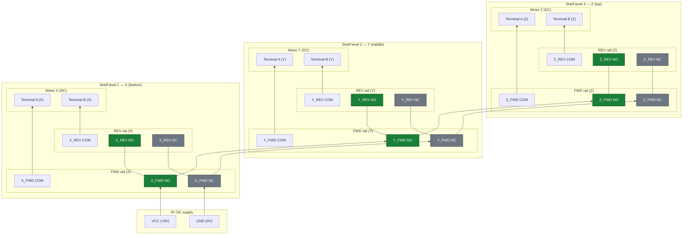
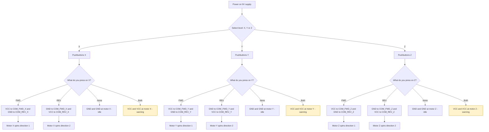

## 1) Diagrama de actividades

```mermaid
flowchart LR
  %% ===== Lanes (subgraphs) por responsable =====
  subgraph A [Alejandra]
    A1[Repo and Wiki enabled]
    A2[Standard folders ready]
    A4[Board visible with assigned issues]
    A9[Consolidate results and screenshots]
    A11[Log Z issue in Wiki with clip]
    A12[Test plan results and evidence]
    A13[One page operator guide]
    A14[AI use and sources]
    A16[Submit in Teams repo link video zip]
  end

  subgraph L [Lemus]
    L1[Kanban with roles and contributions]
    L2[HMI basic animation sanity check]
    L3[Physical scheme pushbuttons SPDT X Y Z]
    L5[HMI demo in CODESYS start stop pilots states]
    L7[Checklist 9V draft with AI and review]
    L11[Design in Wiki electrical diagram and standards ISA 101 and IEC 61131 3]
  end

  subgraph C [Christian]
    C1[Tag list with attribute and type]
    C2[Ladder IEC 61131 3 with comments]
    C3[Time control and counters]
    C10[Implementation in Wiki CODESYS architecture and IO map]
  end

  subgraph T [All team]
    T1[9V test and record evidence]
    D1{Expected behavior}
    F1[Diagnose and correct]
    Z2[Decision operate Z with low load or document limitation]
    V1[Video 10 min simulation prototype E Stop fault]
  end

  %% ===== Flujo principal =====
  A1 --> A2 --> L1 --> A4
  A4 --> L2 --> L3 --> C1 --> C2 --> C3 --> L5
  L5 --> L7 --> T1 --> D1
  D1 -- Yes --> A9 --> A11 --> Z2 --> A12 --> A13 --> A14 --> C10 --> L11 --> V1 --> A16
  D1 -- No --> F1 --> T1


```

---

## 2) Diagrama Eléctrico

---
## 3) Diagrama de usabilidad

---

# Documentación de variables en codesys

| **Nombre**      | **Tipo** | **Descripción** |
|-----------------|----------|-----------------|
| Movement_X      | INT      | Posición actual del eje X (0–176). |
| Movement_Y      | INT      | Posición actual del eje Y (0–176). |
| Movement_Z      | INT      | Posición actual del eje Z (0–176). |
| CountUp_x       | INT      | Conteo de incrementos en eje X. |
| CountD_x        | INT      | Conteo de decrementos en eje X. |
| CountUp_y       | INT      | Conteo de incrementos en eje Y. |
| CountD_y        | INT      | Conteo de decrementos en eje Y. |
| CountUp_z       | INT      | Conteo de incrementos en eje Z. |
| CountD_z        | INT      | Conteo de decrementos en eje Z. |
| Flanco_ax       | BOOL     | Flanco de avance en eje X (detector de pulso). |
| Flanco_bx       | BOOL     | Flanco de retroceso en eje X. |
| Flanco_ay       | BOOL     | Flanco de avance en eje Y. |
| Flanco_by       | BOOL     | Flanco de retroceso en eje Y. |
| Flanco_az       | BOOL     | Flanco de avance en eje Z. |
| Flanco_bz       | BOOL     | Flanco de retroceso en eje Z. |
| Power_light     | BOOL     | Indicador luminoso de encendido del sistema. |
| Power_on        | BOOL     | Interruptor general de encendido. |
| Error           | BOOL     | Señal de error general (colisión o doble orden). |
| Advance_x       | BOOL     | Orden de avance en eje X (desde HMI o pulsador). |
| Advance_y       | BOOL     | Orden de avance en eje Y. |
| Advance_z       | BOOL     | Orden de avance en eje Z. |
| Back_x          | BOOL     | Orden de retroceso en eje X. |
| Back_y          | BOOL     | Orden de retroceso en eje Y. |
| Back_z          | BOOL     | Orden de retroceso en eje Z. |
| Limit_ax        | BOOL     | Sensor de límite superior en eje X. |
| Limit_bx        | BOOL     | Sensor de límite inferior en eje X. |
| Limit_ay        | BOOL     | Sensor de límite superior en eje Y. |
| Limit_by        | BOOL     | Sensor de límite inferior en eje Y. |
| Limit_az        | BOOL     | Sensor de límite superior en eje Z. |
| Limit_bz        | BOOL     | Sensor de límite inferior en eje Z. |
| Lamp_ax         | BOOL     | Lámpara de estado avance eje X. |
| Lamp_bx         | BOOL     | Lámpara de estado retroceso eje X. |
| Lamp_ay         | BOOL     | Lámpara de estado avance eje Y. |
| Lamp_by         | BOOL     | Lámpara de estado retroceso eje Y. |
| Lamp_az         | BOOL     | Lámpara de estado avance eje Z. |
| Lamp_bz         | BOOL     | Lámpara de estado retroceso eje Z. |
| Ton_ax          | TON      | Temporizador para avance eje X. |
| Ton_bx          | TON      | Temporizador para retroceso eje X. |
| Ton_ay          | TON      | Temporizador para avance eje Y. |
| Ton_by          | TON      | Temporizador para retroceso eje Y. |
| Ton_az          | TON      | Temporizador para avance eje Z. |
| Ton_bz          | TON      | Temporizador para retroceso eje Z. |
| Cont_ax         | CTU      | Contador de pasos avance eje X. |
| Cont_bx         | CTU      | Contador de pasos retroceso eje X. |
| Cont_ay         | CTU      | Contador de pasos avance eje Y. |
| Cont_by         | CTU      | Contador de pasos retroceso eje Y. |
| Cont_az         | CTU      | Contador de pasos avance eje Z. |
| Cont_bz         | CTU      | Contador de pasos retroceso eje Z. |
| Time_ax         | TIME     | Tiempo configurado para avance eje X. |
| Time_bx         | TIME     | Tiempo configurado para retroceso eje X. |
| Time_ay         | TIME     | Tiempo configurado para avance eje Y. |
| Time_by         | TIME     | Tiempo configurado para retroceso eje Y. |
| Time_az         | TIME     | Tiempo configurado para avance eje Z. |
| Time_bz         | TIME     | Tiempo configurado para retroceso eje Z. |

# Mapeo de salidas y entradas

## Entradas digitales

| **Variable**  | **Dirección** | **Pin ESP32** | **Descripción** |
|---------------|---------------|----------------|-----------------|
| Power_on      | %IX0.0        | GPIO 13       | Botón de encendido general |
| Advance_x     | %IX0.1        | GPIO 14       | Botón avance eje X |
| Back_x        | %IX0.2        | GPIO 27       | Botón retroceso eje X |
| Advance_y     | %IX0.3        | GPIO 26       | Botón avance eje Y |
| Back_y        | %IX0.4        | GPIO 25       | Botón retroceso eje Y |
| Advance_z     | %IX0.5        | GPIO 33       | Botón avance eje Z |
| Back_z        | %IX0.6        | GPIO 32       | Botón retroceso eje Z |

## Salidas digitales

| **Variable**  | **Dirección** | **Pin ESP32** | **Descripción** |
|---------------|---------------|----------------|-----------------|
| Power_light   | %QX0.0        | GPIO 2        | Luz de encendido general |
| Lamp_ax       | %QX0.1        | GPIO 4        | Luz avance eje X |
| Lamp_bx       | %QX0.2        | GPIO 5        | Luz retroceso eje X |
| Lamp_ay       | %QX0.3        | GPIO 18       | Luz avance eje Y |
| Lamp_by       | %QX0.4        | GPIO 19       | Luz retroceso eje Y |
| Lamp_az       | %QX0.5        | GPIO 21       | Luz avance eje Z |
| Lamp_bz       | %QX0.6        | GPIO 22       | Luz retroceso eje Z |
| Error         | %QX0.7        | GPIO 23       | Luz/alarm indicador de error |
