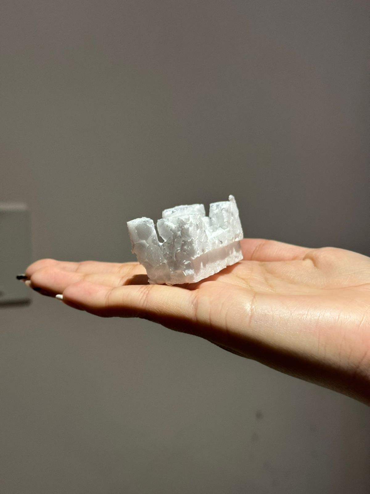
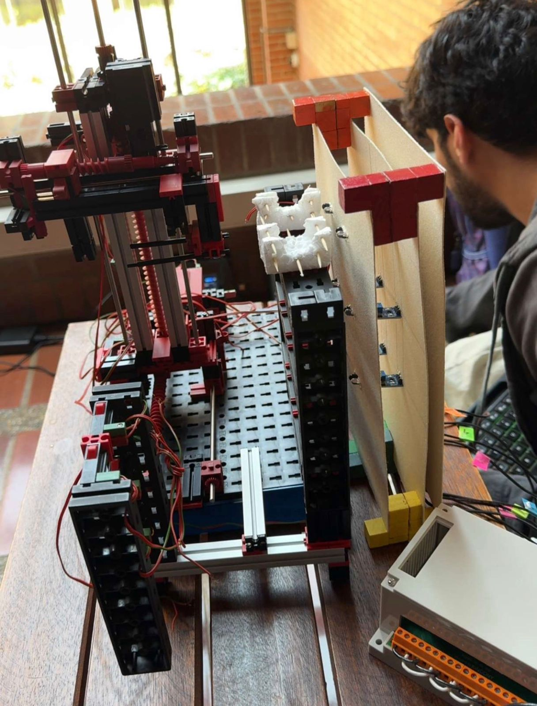
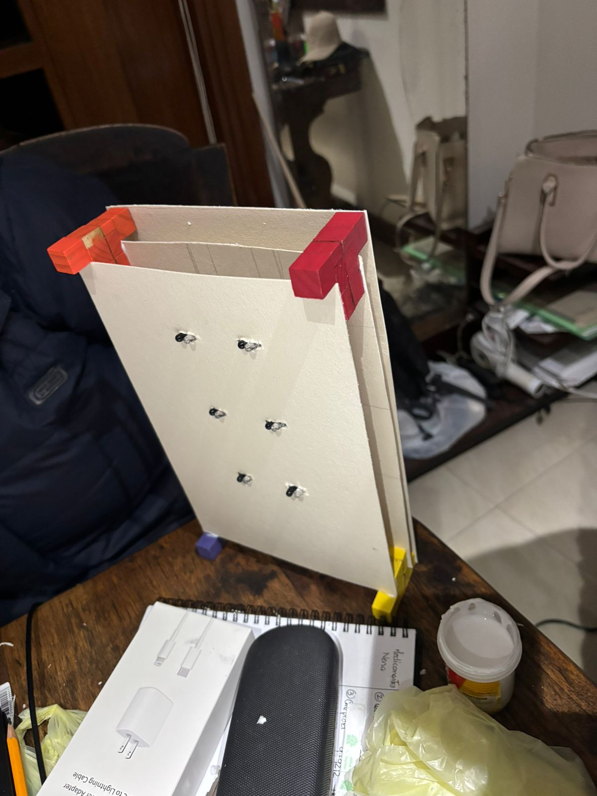
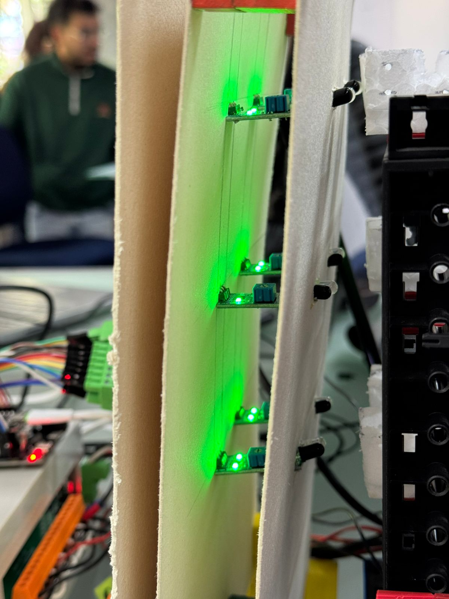
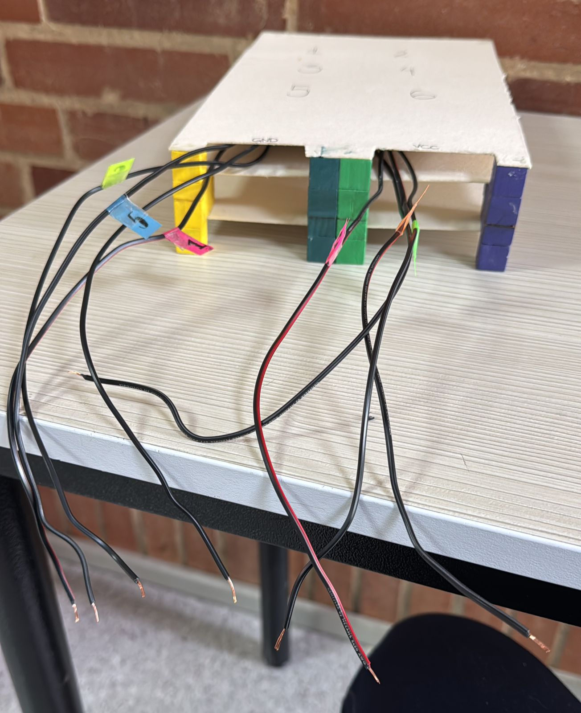

# PROYECTO INTERMEDIO IIOT #3
Christian Daniel Morales Jimenez, Maria Alejandra Cabrera Arauz, Juan Diego Lemus Rey

## 1. Resumen General, Motivación y Estructura del Documento

### 1.1 Resumen General
El presente documento describe el diseño, desarrollo e integración del Gemelo Digital del módulo High Bay Storage de Fischertechnik, realizado como proyecto final del curso Internet Industrial de las Cosas (IIoT). El trabajo se desarrolló de manera progresiva a lo largo de los tres cortes del semestre, consolidando al final una solución integral que combina automatización física, visualización digital, conectividad industrial y modelación de participación dentro de una fábrica inteligente.

Durante el Primer Corte, se analizó el proceso industrial del sistema de almacenamiento automático, identificando la lógica de operación, los eventos críticos, los flujos de trabajo y los requisitos de control necesarios. En el Segundo Corte, se implementó la base del Gemelo Digital: la automatización del módulo mediante actuadores, la integración de sensores, la estructura de comunicación con el PLC emulado y el desarrollo inicial de la interfaz digital que representó el comportamiento del proceso.

Finalmente, en el Tercer Corte, se integró la solución completa. Esto incluyó la incorporación de simulaciones adicionales para resolver limitaciones físicas del kit, el diseño y fabricación de elementos externos requeridos para asegurar la compatibilidad mecánica del proceso, la conexión en tiempo real entre el modelo físico y digital mediante protocolos industriales, y la validación final del sistema.

Como resultado, se obtuvo un sistema capaz de operar el módulo High Bay Storage de forma completamente automatizada, visualizar su estado operativo en tiempo real y participar dentro del modelo de una Fábrica Inteligente, correspondiente al curso de IIoT del semestre 2025-2. En este entorno colaborativo, nuestro módulo cumple el rol de punto inicial del flujo productivo: selecciona el producto y posteriormente lo pone en la basa para entrega al siguiente equipo que se encarga del transporte hacia la máquina de clasificación.

### 1.2 Motivación
La industria está migrando hacia modelos de automatización más flexibles, conectados y capaces de operar con información en tiempo real, es por eso que los gemelos digitales y el IoT toman un papel fundamental, pues permiten anticipar fallas, optimizar recursos y validar decisiones antes de implementar cambios en el entorno físico. Durante los tres cortes trabajamos con la plataforma Fischertechnik ya que facilita la experimentación con procesos industriales reales a pequeña escala. 

La motivación principal fue lograr una solución completa que incorporara no solo la automatización, sino también elementos de IIoT. Es importante resaltar que varios comportamientos del módulo no pueden simularse o resolverse únicamente con las fichas estándar por lo que se diseño soportes, simulaciones y adaptaciones externas, motivando un enfoque ingenieril más creativo y completo. Además, el enfoque del curso, incrementando los resultados por cortes motivó a estructurar la solución desde cero, con entregables funcionales en cada etapa y un producto final completamente integrado.

### 1.3 Justificación
Durante el desarrollo del proyecto se identificaron varias necesidades que justificaron el enfoque adoptado. Primero, integrar un modelo físico con un modelo digital permitió comprender y aplicar de manera práctica los principios de IIoT, incluyendo comunicación industrial, monitoreo distribuido y conectividad. Segundo, la naturaleza modular del High Bay Storage exigió resolver limitaciones técnicas no contempladas en los kits originales, tales como "productos" compatibles con el sistema, la simulación del comportamiento de sensores externos y la adaptación física del entorno para lograr una detección confiable. Estas necesidades impulsaron un proceso de diseño ingenieril real, en el que fue necesario proponer, validar y ajustar soluciones tanto en hardware como en software.

Por otro lado, la estructura del repositorio permitió documentar la evolución del proyecto y mantener control sobre cada fase. El Tercer Corte consolida toda la solución final, integrando el PLC emulado, la HMI, el sistema embebido para comunicación, el gemelo digital y las pruebas de interacción con otros equipos. En conjunto, el proyecto demuestra una solución integral, escalable y alineada con los requerimientos establecidos para la implementación de un Gemelo Digital funcional y su participación en un modelo de Fábrica Inteligente.

### 1.4 Estructura de la Documentación
La documentación se organiza para reflejar el proceso completo del proyecto:

- La Sección 1 se presenta el contexto general, la motivación del trabajo, su importancia y cómo está estructurado el documento.
- La Sección 2 describe la solución propuesta: restricciones identificadas, arquitectura del sistema y las decisiones de diseño tanto de hardware como de software.
- La Sección 3 se detalla el desarrollo modular completo.
- La Sección 4 explica la configuración experimental, los resultados obtenidos y el análisis comparativo entre el gemelo digital y el prototipo físico.
- La Sección 5 presenta la autoevaluación del protocolo de pruebas y las mejoras que surgieron a partir de las validaciones.
- La Sección 6 incluye conclusiones, retos enfrentados, recomendaciones para trabajo futuro y las referencias consultadas.

Finalmente, los Anexos distribuidos en diferentes carpetas contienen el código fuente documentado, esquemáticos, diseños físicos y material complementario, junto con el video demostrativo que resume el funcionamiento de la solución.

### 1.5 Roles y Contribuciones

| Categoría                     | Criterio                                                                                              | Responsable |
|------------------------------|--------------------------------------------------------------------------------------------------------|-------------|
| Gestión de proyecto          | Repositorio Git creado                                                                                 | Maria Alejandra Cabrera Arauz |
| Gestión de proyecto          | Estructura de carpetas estandarizada                                                                   | Maria Alejandra Cabrera Arauz |
| Gestión de proyecto          | Tablero con roles y contribuciones por integrante                                                      | Maria Alejandra Cabrera Arauz |
| Gestión de proyecto          | Actualización continua de issues y commits                                                             | Todos |
| Diseño Ingenieril            | Identificación completa de restricciones técnicas, económicas y operativas                             |             |
| Diseño Ingenieril            | Diseño y desarrollo de soluciones para resolver limitaciones externas del módulo                       | Todos |
| Diseño Ingenieril            | Diseño del sistema de detección con 6 sensores de proximidad, soportes y cableado                      | Maria Alejandra Cabrera Arauz |
| Diseño Ingenieril            | Modelado teórico del flujo de almacenamiento y transferencia entre módulos                             |             |
| Diseño Ingenieril            | Diagramas de bloques de arquitectura (hardware y software)                                             |             |
| Diseño Ingenieril            | Diagramas UML de todos los módulos de software                                                         |             |
| Diseño Ingenieril            | Esquemáticos de interconexión del hardware                                                             |             |
| Diseño Ingenieril            | Aplicación de estándares de diseño de ingeniería                                                       |             |
| Prototipo y Validación       | Integración correcta PLC–sensores–actuadores–ESP32                                                     |             |
| Prototipo y Validación       | Validación del funcionamiento del DT según requisitos mínimos                                          |             |
| Prototipo y Validación       | Pruebas del sistema de detección con sensores (ocupación real vs simulación)                           |             |
| Prototipo y Validación       | Validación del transporte de fichas con canastos de icopor                                             | Maria Alejandra Cabrera Arauz |
| Prototipo y Validación       | Interoperabilidad con otros módulos de la Fábrica Inteligente                                          |             |
| Prototipo y Validación       | Evaluación del desempeño: errores, fallos, mejoras                                                     |             |
| Wiki técnica                 | Resumen General, Motivación, Justificación y Estructura del Documento                                  | Maria Alejandra Cabrera Arauz |
| Wiki técnica                 | Documentación de restricciones de diseño y criterios de diseño                                         |             |
| Wiki técnica                 | Documentación del módulo de simulación del almacén                                                     |             |
| Wiki técnica                 | Documentación del diseño físico complementario (canasto + sensores + soportes)                         | Maria Alejandra Cabrera Arauz |
| Wiki técnica                 | Resultados experimentales y análisis técnico                                                           |             |
| Wiki técnica                 | Autoevaluación del protocolo de pruebas                                                                |             |
| Wiki técnica                 | Declaración del uso de IA y fuentes bibliográficas (IEEE)                                              | Todos |
| Comunicación                 | Presentación clara y concisa durante el pitch                                                          | Todos |
| Comunicación                 | Uso adecuado de lenguaje ingenieril                                                                    | Todos |
| Comunicación                 | Explicación del flujo del proceso y dinámica del DT                                                    | Todos |
| Comunicación                 | Respuesta clara a preguntas del jurado                                                                 | Todos |
| Comunicación                 | Apoyo visual: tablas, esquemas y figuras estéticas                                                     | Todos |
| Video                        | Demostración del DT (simulación + prototipo + E-Stop + anomalía)                                       | Todos |
| Video                        | Explicación de la integración con Fábrica Inteligente                                                  | Todos |
| Video                        | Participación de todos los miembros del equipo                                                         | Todos |
| Autoaprendizaje              | Aprendizaje autónomo sobre sensores, soldadura, prototipado y simulación                               | Todos |
| Autoaprendizaje              | Apropiación de nuevos conceptos de IIoT y comunicación industrial                                      | Todos |
| Autoaprendizaje              | Aplicación del aprendizaje adquirido para solucionar problemas reales del proyecto                     | Todos |

---

## 2. Solución Propuesta

### 2.1 Restricciones de Diseño Identificadas
Durante la etapa de pruebas identificamos limitaciones críticas del módulo High Bay Storage que afectaban su rendimiento dentro de la Fábrica Inteligente del curso:

- Las fichas originales del kit son pequeñas en comparación a lo que necesitabamos, lo que dificultaba que el brazo de la máquina las tomara de manera estable y sin caídas. Esta restricción provocaba fallas en la transferencia entre módulos, retrasos y pérdidas de ciclo.

- El módulo dependía de una operación casi totalmente manual: un botón físico iniciaba el ciclo, lo cual introducía riesgo de errores humanos, activaciones a destiempo y operaciones en posiciones vacías.

Estas restricciones motivaron el diseño de soluciones físicas y electrónicas complementarias para garantizar estabilidad y continuidad del proceso.

### 2.2 Arquitectura Propuesta

#### 2.2.1 Arquitectura de Hardware
Diagrama de bloques del hardware:

Para resolver los desafíos anteriores se incorporaron dos desarrollos propios dentro de la arquitectura de hardware del sistema:

A) Canastos de transporte en icopor:

Se diseñaron pequeños contenedores en icopor que envuelven temporalmente la ficha. De esta forma, aumentamos el volumen y la estabilidad de la ficha durante su transporte, garantizamos que la ficha llegue alineada a la zona donde la siguiente máquina la toma, evitamos atascos y movimientos bruscos durante el desplazamiento vertical y además, el diseño garantiza que la segunda máquina solo tome la ficha, dejando el canasto atrás sin alterar su proceso.

B) Sistema de monitoreo de inventario con 6 sensores de proximidad:

Para eliminar dependencia del botón físico y evitar movimientos innecesarios en posiciones vacías, se diseñó un sistema externo montado detrás del almacén en cartón paja reforzado con soportes de madera para garantizar rigidez, se instalaron 6 sensores de proximidad, uno por cada posición del almacén y se aseguró cada sensor (que posee líneas GND, VCC y OUT) con soldadura. Este sistema actúa como una “pared inteligente” detrás del almacén que informa constantemente al PLC si cada posición está ocupada o vacía, optimizando el tiempo y evitando ciclos innecesarios.

#### 2.2.2 Arquitectura de Software
Diagrama de bloques del software: 

---

## 3. Desarrollo Teórico y Modular

### 3.1 Criterios de Diseño Establecidos

### 3.2 UML de la Solución Completa
- Diagrama de casos de uso:
- Diagrama de clases:
- Diagrama de secuencia por módulos:
- Diagrama de componentes:

### 3.3 Desarrollo por Módulos de Software
Para integrar los 6 sensores de la pared se implementó un módulo de software que lee el estado de cada sensor (ocupado/vacío), actualiza en tiempo real la visualización del almacén en la HMI, evita operaciones inválidas cuando un espacio está vacío y permite simular movimientos antes de ejecutarlos físicamente. Este módulo se probó inicialmente usando valores simulados, lo que permitió verificar la lógica antes de soldar o montar hardware.

### 3.4 Esquemáticos de Hardware Diseñados
A continuación compartimos las diferentes evidencias de la contrucción:

- Prototipos de canastos de icopor:
  

- El sistema de sensores montado detrás del almacén:
  

- La estructura de cartón paja y madera que sostiene los sensores:
  

- Sensores posicionados en la maqueta:
  

- Cabledo en la maqueta de los sensores:
  

- PLC Cableada y en funcionamiento:
  

### 3.5 Estándares de Ingeniería Aplicados
Normativas y buenas prácticas utilizadas:

---

## 4. Configuración Experimental, Resultados y Análisis

### 4.1 Configuración Experimental 
Durante la validación del sistema se realizaron las siguientes pruebas:

1. Pruebas del canasto de transporte de fichas:

- Encaje del canasto en las pinzas de la maquina.
- Desplazamiento vertical sin atascos.
- Estabilidad al entregar la ficha a la segunda máquina.
- Separación correcta entre canasto y ficha.

2. Pruebas de sensores de almacen:

- Se calibró la distancia óptima de detección para cada sensor.
- Se verificó la lectura correcta del PLC para el estado de cada posición.
- Se midió el tiempo de respuesta del sistema ante cambios en el inventario.
- Se verificó que la máquina no ejecutara ciclos innecesarios.

### 4.2 Resultados
En la parte de diseño y desarrollo de soluciones complementarias para resolver limitaciones, obtuvimos ciclos exitosos en transporte usando canastos, ya que no se presentaron caídas ni desalineaciones. Además, se eliminaron los movimientos a posiciones vacías gracias al sistema de sensores. La simulación utilizada previamente coincidió con el comportamiento real, lo que permitió reducir tiempo de pruebas físicas. Y por ultimo, las fichas se entregaron correctamente a la siguiente máquina sin afectar su proceso original.

### 4.3 Análisis

---

## 5. Autoevaluación del Protocolo de Pruebas

---

## 6. Conclusiones, Retos, Trabajo Futuro y Referencias

### 6.1 Conclusiones
A lo largo del proyecto se comprobó que, aunque la plataforma Fischertechnik ofrece una base funcional, su adaptación a un entorno colaborativo de tres máquinas requiere creatividad, pruebas continuas y ajustes físicos. La incorporación de los canastos de icopor permitió que la transferencia entre máquinas fuera más estable, y el sistema de sensores de proximidad permitió evitar operaciones innecesarias al detectar en tiempo real si un espacio estaba vacío u ocupado. La combinación del modelo digital con la implementación física mejoró la precisión del proceso y redujo errores humanos, demostrando el valor del IoT industrial cuando se integra con decisiones de diseño bien fundamentadas.

### 6.2 Retos Presentados
A lo largo del proyecto surgieron varios retos que exigieron ajustes constantes y experimentación:

En el diseño del sistema de transporte inicialmente se probó con piezas de madera como remplazo a las fichas originales en forma de "T", pero su peso y tamaño no eran compatibles con la interacción entre máquinas. Por esto se pasó al icopor, que funcionó mejor por su ligereza. Sin embargo, este cambio implicó múltiples cortes, pruebas y rediseños. Ahora, sobre el sistema de sensores de proximidad, encontramos que instalar seis sensores detrás del almacén es un desafío importante. La soldadura de los pines fue compleja debido a la cercanía entre ellos, lo que obligó a separarlos cuidadosamente y organizar el cableado de forma más limpia para evitar falsos contactos. También fue difícil asegurar que los soportes de madera mantuvieran la alineación exacta de los sensores, ya que cualquier desviación afectaba la detección. Además, organizar el paso de los cables para que no interfirieran con el movimiento del módulo requirió planificación y ajustes físicos constantes.

### 6.3 Trabajo Futuro
El proyecto deja varias oportunidades claras para continuar mejorando la solución:

1. Diseño de nuevos canastos más sostenibles, puesto que el icopor cumplió su función, pero no es un material adecuado para proyectos a largo plazo ni ambientalmente responsable. Una opción futura sería diseñar contenedores en PLA o PETG impresos en 3D, con medidas exactas y mayor durabilidad.

### 6.4 Referencias y uso de IA

Para la construcción del sistema físico y la integración del Digital Twin se consultaron las siguientes fuentes principales:

- Documentación oficial Fischertechnik para el módulo High Bay Storage.
- Material académico del curso Internet Industrial de las Cosas – Universidad de La Sabana.
- Hojas técnicas de sensores de proximidad y componentes electrónicos utilizados.

**IA:**
En cuanto al uso de herramientas de inteligencia artificial, se empleó IA únicamente para redacción, organización de ideas y mejora de la documentación, sin que estas herramientas generaran código, decisiones de diseño ni componentes esenciales del sistema. Todo el trabajo físico, soldaduras, diseño de canastos y diseño del sistema de sensores fue realizado manualmente por el equipo.
